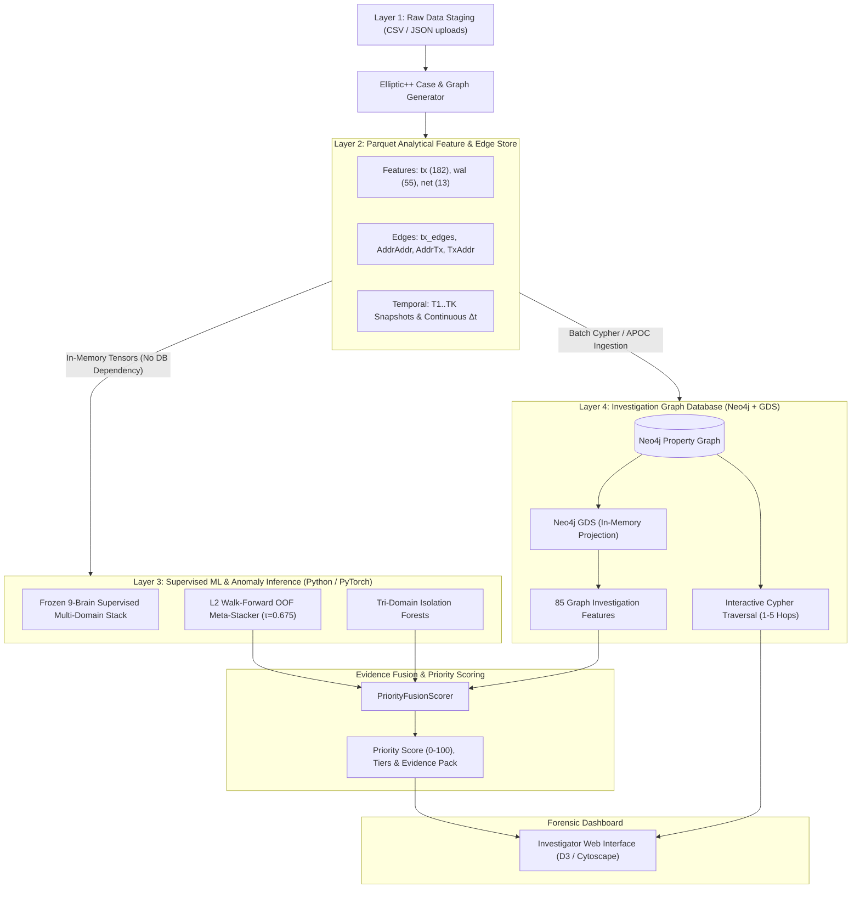

# Database Architecture Plan: Multi-Tier Forensic Storage & Neo4j GDS Integration

**Project:** AI-Powered Monitoring & Analysis of Bitcoin Transaction Traffic (SIH26146)  
**System Target:** `Bitcoin-Investigation-platform`  
**Document:** `DATABASE_ARCHITECTURE.md` (Implementation Blueprint)  
**Core Thesis:** **Yes, we need a database — but Neo4j is not the only storage system.**  
Neo4j is specifically the **investigation graph database and graph-analytics engine (GDS)**, while **Parquet** serves as the analytical ML feature store, **SQLite/PostgreSQL** manages the operational platform catalog (cases, users, runs), and **Python/PyTorch** owns the model weights and inference execution.

---

## 1. The 4-Layer Database & Storage Hierarchy



---

## 2. Why Neo4j Alone Is Not Enough (And Why Parquet is Essential)

| Storage Layer | Technology | Primary Role | What It Stores | Why It's Best Suited |
|:---|:---|:---|:---|:---|
| **Operational Catalog** | SQLite / PostgreSQL | Platform State | Users, Cases, Datasets, Analysis Runs, Audit Logs, Feedback | ACID transactions, relational integrity, lightweight deployment. |
| **Analytical Feature Store** | Parquet (Apache Arrow) | ML Tensors & Archival | $N \times 182$ Tx features, $M \times 55$ Wallet features, $N \times 13$ Network features, sparse edge lists | Columnar compression, vectorization, zero deserialization overhead into PyTorch/Scikit-Learn. |
| **Investigation Graph DB** | Neo4j Community / EE | Entity Relationships | Nodes (`:Transaction`, `:Wallet`, `:Originator`, `:NetworkEvent`) & Typed Edges | Index-free adjacency, native multi-hop Cypher queries, graph visualization. |
| **Graph Analytics Engine** | Neo4j GDS | Graph Feature Engineering | In-memory projected case subgraphs | Parallelized PageRank, Betweenness, Leiden, Louvain, K-Core, WCC producing 85 investigation features. |
| **Model Weights Store** | Local Filesystem / `models/` | Frozen Machine Learning | `.joblib` and `.pt` serialized weights (16 artifacts) | Read-only model checkpoints mapped to CPU/GPU with memory-mapping. |

---

## 3. Neo4j Graph Schema Specification

Neo4j is a **Property Graph Database**: nodes and directed, typed relationships both carry attributes.

### 3.1 Node Labels & Schema

#### A. Node: `:Transaction`
Represents an individual Bitcoin transaction:
```json
{
  "txid": "230425980",              // Unique transaction hash or Elliptic ID (Indexed)
  "case_id": "CASE_2026_001",       // Scopes queries to the specific investigation
  "timestamp": "2026-09-23T05:13:00Z",
  "time_step": 14,                  // Chronological snapshot index (1..K)
  "amount_btc": 12.4502,            // Total transacted value
  "fee_btc": 0.00015,
  "size_bytes": 225,
  "input_count": 2,
  "output_count": 2,
  "supervised_score": 88.5,         // Written back from ML inference
  "anomaly_score": 0.72,            // Written back from Isolation Forest
  "priority_score": 85.2,           // Final fused priority (0-100)
  "severity_tier": "CRITICAL"       // CRITICAL, HIGH, MEDIUM, LOW
}
```

#### B. Node: `:Wallet`
Represents an on-chain address participating in input or output flows:
```json
{
  "address": "1111DAYXhoxZx2tsRnzimfozo783x1yC2", // Base58 / Bech32 address (Indexed)
  "case_id": "CASE_2026_001",
  "first_seen": "2026-09-20T10:00:00Z",
  "last_seen": "2026-09-23T05:13:00Z",
  "total_transactions": 34,
  "total_btc_sent": 45.2,
  "total_btc_received": 52.8,
  "supervised_score": 74.0,
  "anomaly_score": 0.65,
  "cluster_id": "CLUST_89"          // Multi-input co-spending cluster
}
```

#### C. Node: `:Originator` (Network Relay / Peer)
Represents network telemetry nodes observing gossip propagation:
```json
{
  "originator_id": "ip:198.51.100.42",
  "ip_address": "198.51.100.42",
  "asn": "AS13335",
  "country": "US",
  "observation_count": 18,
  "first_seen": "2026-09-23T05:12:58Z",
  "last_seen": "2026-09-23T05:13:02Z",
  "anomaly_score": 0.81
}
```

---

### 3.2 Relationship Types & Schema

| Relationship Type | Source Node | Target Node | Key Relationship Properties |
|:---|:---|:---|:---|
| `[:SPENT_FROM]` / `[:INPUT_TO]` | `:Wallet` | `:Transaction` | `input_index`, `amount_btc`, `script_type`, `timestamp` |
| `[:OUTPUT_TO]` / `[:SENT_TO]` | `:Transaction` | `:Wallet` | `output_index`, `amount_btc`, `script_type`, `timestamp` |
| `[:FLOWS_TO]` | `:Transaction` | `:Transaction` | `amount_btc`, `spent_output_index`, `time_delta_seconds` |
| `[:INTERACTS_WITH]` | `:Wallet` | `:Wallet` | `total_amount_btc`, `tx_count`, `co_spending_affinity` |
| `[:OBSERVED]` / `[:RELAYED_BY]` | `:Originator` | `:Transaction` | `first_seen_timestamp`, `propagation_latency_ms` |

---

## 4. Neo4j Graph Data Science (GDS) Integration

Neo4j separates persistent storage from GDS's in-memory projection:

```text
Persistent Graph (Disk) ──> GDS In-Memory Projection ──> Algorithm Pipeline ──> Node Properties (Write-Back)
```

### 4.1 In-Memory Graph Projection (Cypher)
```cypher
CALL gds.graph.project(
  'case_investigation_graph',
  ['Transaction', 'Wallet'],
  {
    FLOWS_TO: { orientation: 'NATURAL', properties: ['amount_btc'] },
    INTERACTS_WITH: { orientation: 'UNDIRECTED', properties: ['total_amount_btc'] }
  }
);
```

### 4.2 GDS Algorithms Producing the 85 Graph Features
1. **Centrality Algorithms:**
   - `gds.pageRank.stream` / `write`: Computes structural importance and financial flow hubs.
   - `gds.betweenness.stream` / `write`: Identifies mixing services, peeling nodes, and bridge addresses.
   - `gds.articleRank.stream`: Dampens high-degree hub distortion in transaction graphs.
2. **Community Detection Algorithms:**
   - `gds.wcc.stream` / `write`: Identifies disjoint transaction components.
   - `gds.leiden.stream` / `write` or `gds.louvain.stream`: Segregates money-laundering rings and co-spending clusters.
   - `gds.kcore.stream`: Extracts dense sub-networks of repetitive transacting.
3. **Neighborhood & Degree Metrics:**
   - Directed weighted in/out degree, triangle count, and local clustering coefficient.

### 4.3 Exporting GDS Metrics Back to Platform
Results from GDS are either:
1. Written directly to nodes in Neo4j via `gds.*.write` (e.g. `n.pagerank`, `n.community_id`) for visual dashboard styling.
2. Streamed back to Python (`gds.*.stream`) and saved as `investigation_graph_features.parquet` to feed the `PriorityFusionScorer`.

---

## 5. Directory Layout for Platform Database & Storage

```text
Bitcoin-Investigation-platform/
├── data/
│   ├── app.db                                 # SQLite operational catalog (users, cases, runs)
│   └── cases/
│       └── <case_id>/
│           ├── raw/                           # Uploaded CSV / JSON files
│           │   ├── transactions.csv
│           │   ├── inputs.csv
│           │   ├── outputs.csv
│           │   └── network.csv
│           ├── generated/                     # Standardized Parquet layer (Elliptic++ format)
│           │   ├── transaction/
│           │   │   ├── features.parquet       # N x 182 features
│           │   │   ├── edgelist.parquet       # Money-flow graph
│           │   │   └── temporal.parquet       # T1..TK snapshots
│           │   ├── wallet/
│           │   │   ├── features.parquet       # M x 55 features
│           │   │   ├── addr_addr_edgelist.parquet
│           │   │   ├── addr_tx_edgelist.parquet
│           │   │   └── temporal.parquet
│           │   └── network/
│           │       ├── features.parquet       # N x 13 features
│           │       └── temporal_mesh.parquet
│           ├── gds/
│           │   └── investigation_features.parquet  # 85 GDS metrics
│           └── reports/
│               └── case_investigation_report.json
├── ml_engine/
│   └── SIH_SUPERVISED_ML/
│       ├── models/                            # 16 serialized model weights (.joblib, .pt)
│       └── architectures/                     # PyTorch model definitions
└── backend/app/
    ├── db/                                    # SQLAlchemy database session & models
    └── services/
        ├── elliptic_case_generator.py         # Transforms raw -> Parquet
        ├── neo4j_service.py                   # Ingests Parquet -> Neo4j & runs GDS
        ├── ml_inference.py                    # Runs PyTorch/Sklearn ML (Direct Parquet)
        └── scoring.py                         # Fuses ML + IF + GDS + Rules
```

---

## 6. Failure Mode & Resilience Contract

1. **Neo4j Offline / Unavailable:**
   - ML inference continues with $100\%$ capacity directly from Parquet.
   - The platform falls back to computing lightweight graph metrics via NetworkX in Python.
   - The Priority Fusion Scorer adjusts component weights to maintain valid priority scores.
2. **Read-Only / Air-Gapped Mode:**
   - Parquet files and SQLite allow the entire platform to operate with zero external network connectivity.
