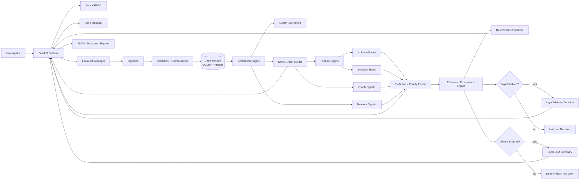

# AI-Powered Monitoring & Analysis of Bitcoin Transaction Traffic
## Backend-First Prototype Specification

> **Status:** Prototype / Proof of Concept  
> **Document role:** Single source of truth for implementation  
> **Primary build order:** Backend → backend hardening → frontend → integration  
> **Operating principle:** Evidence, not verdicts

---

## 1. Project Overview

### 1.1 Project purpose

Build an **offline-first investigative intelligence backend** that ingests synthetic Bitcoin blockchain/transaction metadata and Bitcoin P2P/network observations, correlates them, constructs an entity graph, extracts behavioral and graph features, detects unusual patterns, ranks investigation leads, and returns evidence-backed explanations for an investigator.

The prototype addresses Smart India Hackathon problem statement **SIH26146: AI-Powered Monitoring & Analysis of Bitcoin Transaction Traffic**.

The SIH problem statement calls for combining blockchain-layer transaction information with network-layer metadata and specifically points toward entity clustering, anomaly detection, risk scoring, graph analytics, and explainable alerts. The supplied problem statement also identifies fields such as `timestamp`, `src_ip`, `dst_ip`, ports, `txid`, input/output addresses and amounts, fee, script type, country, and ASN.  

**Source of requirements:** the team-provided SIH problem statement. Keep the source file in `docs/source/SIH26146.pdf` in the repository.

### 1.2 Problem statement and motivation

Bitcoin transactions are public and traceable, but the ledger normally exposes blockchain identifiers rather than a person's name. Network observations add a second layer of context, such as IP addresses, timestamps and ports. Bitcoin.org also notes that relayed transactions can be observed at Bitcoin nodes, but the node observed relaying a transaction can be mistaken for its source. Therefore, blockchain and network evidence must be correlated carefully and presented as evidence with provenance rather than as automatic identity attribution.

The project solves the engineering problem:

```text
Raw transaction data + network telemetry
                ↓
          Hard to inspect manually
                ↓
    Correlation + graph construction
                ↓
       Behavioral feature extraction
                ↓
      Anomaly + rule + graph signals
                ↓
    Evidence-backed investigation leads
```

The system is **not** intended to:

- prove criminal activity;
- identify a real person from an IP address alone;
- infer wallet ownership as fact from a heuristic;
- replace investigators or legal processes;
- generate unsupported conclusions through an LLM.

### 1.3 Target users

| User | Primary need | Prototype capability |
|---|---|---|
| Digital-forensics investigator | Find unusual entities quickly | Ranked alerts, wallet detail, graph, timeline |
| Cybercrime analyst | Correlate network and blockchain observations | TX/IP correlation and graph |
| Intelligence analyst | Understand clusters and relationships | Communities, motifs, connected entities |
| Technical reviewer | Verify why a result was produced | Feature values, rule hits, source-record IDs |
| System administrator | Run and reset local cases | Case management, health, authentication |

### 1.4 Core use cases

#### UC-01 — Create a case

An authenticated analyst creates a case and obtains a unique `case_id`.

#### UC-02 — Ingest blockchain data

Upload CSV, JSON or XML containing canonical transaction fields or a mappable equivalent.

#### UC-03 — Ingest network observations

Upload network telemetry containing timestamp, IP/port information and, where available, `txid`.

#### UC-04 — Correlate datasets

The backend matches network observations to transaction records using an explicit correlation method and records the basis of every match.

#### UC-05 — Build an entity graph

Create nodes for wallets/addresses, transactions, IPs, ASNs and countries, with typed and evidence-backed edges.

#### UC-06 — Detect unusual behavior

Compute transaction, wallet, network and graph features; run Isolation Forest; run deterministic behavioral rules; compute graph signals.

#### UC-07 — Prioritize leads

Calculate an **investigation priority score** that combines detector outputs. Keep anomaly, behavior, graph and network scores separate from each other.

#### UC-08 — Explain an alert

Return exact feature values, rule triggers, graph observations and source-record references for every alert.

#### UC-09 — Review an entity

Open a wallet/entity detail response containing score components, neighboring entities, relevant transactions, IP observations and a timeline.

#### UC-10 — Record investigator feedback

An analyst can mark an alert `relevant`, `benign`, or `needs_review` and add a note. Feedback is retained for evaluation and future model work.

#### UC-11 — Export a case report

Generate a machine-readable JSON report and an evidence-oriented Markdown report.

### 1.5 Success criteria and measurable goals

The following are **prototype targets**, not claims of real-world crime-detection performance.

| Goal | Target | Measurement |
|---|---:|---|
| Schema validation | 100% of accepted rows match canonical schema | Ingestion tests |
| Provenance | 100% of generated alerts contain at least one source/evidence reference | Alert validation test |
| Determinism | Same input + same seed produces same feature/score outputs | Re-run comparison |
| Offline behavior | 0 outbound network calls when `OFFLINE_MODE=true` | Integration test with blocked sockets |
| Synthetic anomaly detection | Target `Precision@20 >= 0.80` on a held-out synthetic seed | Generator ground truth + evaluation script |
| Demo data throughput | Target ≤ 120 s for 50,000 synthetic transaction/network rows on reference development hardware | Benchmark script |
| API availability | `GET /health` succeeds while the application is running | Smoke test |
| Explanation coverage | 100% of high/critical alerts have ≥1 deterministic reason | API test |
| Reproducible demo | One command generates synthetic data and one command runs the analysis | CLI acceptance test |

> **Important:** Synthetic ground truth is generated by the project itself. High synthetic scores demonstrate that the pipeline can detect known planted patterns; they do not establish performance on real criminal activity.

---

# 2. Competitive Analysis

## 2.1 Comparison scope

There are three categories of reference systems:

1. **Commercial blockchain intelligence platforms** — Chainalysis and Elliptic.
2. **SIH/prototype prior art** — Nexus Trace, CoinTrace, Bitcoin Threat Monitor and other SIH repositories.
3. **Academic/open-source ML prior art** — Elliptic dataset projects using Random Forest, SHAP, graph learning and anomaly detection.

### 2.2 Competitive/prior-art table

| Reference | Core features | Strengths | Limitations / gaps relevant to this prototype | What we adopt | How this prototype addresses the gap |
|---|---|---|---|---|---|
| **Chainalysis** | Blockchain intelligence, entity attribution, address clustering, transaction tracing, investigations, risk/compliance workflows | Large intelligence datasets, entity attribution, investigation workflow, graph-based tracing | Commercial/closed ecosystem; not an offline SIH implementation; breadth is far beyond prototype scope | Investigation-first workflow, entity clustering concept, graph tracing | Local/offline architecture; explicit SIH P2P/network fields; transparent prototype scoring and evidence provenance |
| **Elliptic** | Wallet/transaction screening, monitoring, graph investigations, entity intelligence, cross-chain tracing, evidence-oriented workflows | Mature on-chain intelligence, investigation workflow, configurable risk logic | Commercial platform; prototype cannot reproduce its proprietary attribution data or scale | Screening/triage → investigation flow, graph and evidence concepts | Focuses on one Bitcoin/SIH case model, local synthetic data, explicit detector outputs and reproducible logic |
| **Nexus Trace** | Transcript describes combined Bitcoin + network telemetry, Isolation Forest, graph views, alerts, GeoIP, local Llama/Ollama explanation and report generation | Strong investigator-centric demo; combines the two data layers required by SIH; prioritizes leads | Correlation semantics, score semantics and evidence strength need to be made explicit; “unlinked” must not automatically mean anomalous; GeoIP must be described as approximate IP enrichment | Combined data pipeline, investigator dashboard concepts, local LLM layer | Separates anomaly score, behavior score, graph score, network score, evidence coverage and explanation; every graph edge records its evidence basis |
| **CoinTrace / SIH26-CoinTrace** | Synthetic data generation, ingestion/validation, GeoIP, entity graph, feature engineering, Isolation Forest/autoencoder/community/motif modules, dashboard | Closely aligned to SIH; modular architecture; synthetic typology injection | Prototype/reference implementation; limited evidence of production validation; synthetic patterns can bias detector evaluation | Modular pipeline, synthetic scenario generator, local GeoIP enrichment, detector separation | Adds formal API contracts, provenance, run status, deterministic evaluation, evidence objects and testable score semantics |
| **Bitcoin Threat Monitor / SIH peer** | Synthetic data, wallet/IP graph, Isolation Forest, domain rules, explainability, FastAPI, dashboard, offline tests | Explicit tests for no outbound network; rules + model; reports real-data limitations instead of hiding them | Prototype-specific thresholds and features; real-data results can differ substantially from synthetic performance | Rules + ML as complementary evidence, network isolation tests, seeded data | Makes all thresholds configurable, labels scores correctly, separates synthetic evaluation from real-data validation, adds correlation/evidence semantics |
| **Explainable Bitcoin Transaction Detection** | Elliptic dataset, Random Forest, SHAP, temporal split, illicit/licit classification | Useful supervised learning and explainability prior art; demonstrates temporal evaluation | Elliptic features are anonymized; no SIH P2P network layer; supervised labels differ from synthetic SIH data | SHAP for V2, temporal split methodology, feature-attribution reporting | Uses unsupervised IF for MVP because labels are unavailable; later adds supervised models only after dataset/evaluation design is established |
| **AI-Driven Cryptocurrency Transaction Analysis / GNN research** | Graph neural networks, behavioral analysis, multiple datasets and ML models | Demonstrates value of graph-native learning | More complex, needs labels/graph-learning infrastructure and careful evaluation | Graph feature direction and future GNN track | Defers GNNs until V3; MVP uses interpretable NetworkX graph features and rules |

### 2.3 Competitive positioning

The prototype is not trying to win on:

- number of supported blockchains;
- proprietary attribution databases;
- global real-world entity coverage;
- commercial compliance integrations;
- production-scale streaming infrastructure.

It is specifically optimized for the SIH prototype objective:

```text
OFFLINE
+ BITCOIN TRANSACTION DATA
+ P2P / NETWORK METADATA
+ CORRELATION
+ GRAPH ANALYTICS
+ EXPLAINABLE ANOMALY DETECTION
+ EVIDENCE PROVENANCE
+ INVESTIGATOR WORKFLOW
```

---

# 3. Solution & Architecture

## 3.1 Architecture principles

1. **Backend first.** The frontend is a consumer of stable APIs and never owns core detection logic.
2. **Evidence before explanation.** Every score must be reproducible from stored inputs and feature values.
3. **Detectors are modular.** Isolation Forest, rules, graph signals and future supervised/GNN models can be swapped independently.
4. **Observed, derived and inferred evidence are distinct.** Never present a model-derived conclusion as a raw observation.
5. **Offline by default.** No runtime dependency on external APIs.
6. **Fail closed on schema ambiguity.** If the system cannot confidently interpret a required field, the ingestion job fails with a validation report rather than guessing.
7. **LLM is not the detector.** The LLM can summarize an evidence pack; it cannot create evidence.
8. **Laya is optional and experimental.** It is a decision-layer experiment, not the authoritative detector.

## 3.2 High-level architecture



## 3.3 Backend-first build strategy

### Why backend first

The backend contains the actual intellectual and judging-critical pipeline:

```text
input
→ validation
→ normalization
→ correlation
→ graph
→ features
→ detectors
→ score fusion
→ evidence
→ explanation
→ API
```

Building the frontend first would create UI assumptions before the data and evidence contracts are stable. The backend-first plan makes the frontend a thin visualization and interaction layer.

### Build order

```text
Phase 1
  Canonical schemas
  ↓
Phase 2
  File ingestion + validation
  ↓
Phase 3
  Feature engine
  ↓
Phase 4
  Graph + correlation
  ↓
Phase 5
  Isolation Forest + rules
  ↓
Phase 6
  Evidence + priority scoring
  ↓
Phase 7
  FastAPI APIs
  ↓
Phase 8
  Tests + benchmark
  ↓
Phase 9
  Frontend
```

## 3.4 Core components

| Component | Responsibility | Must not do |
|---|---|---|
| API layer | HTTP endpoints, auth, validation, serialization | Run business logic inline inside route handlers |
| Case Manager | Create/list/read cases, case state | Store raw analytical tables in SQLite |
| Ingestion | Read CSV/JSON/XML | Guess ambiguous mappings silently |
| Validation | Check types, required fields, array lengths, timestamps, IPs | Mutate raw source |
| Normalization | Convert fields to canonical representation | Delete source evidence |
| Correlation | Link network observations to transactions | Claim that IP = person/wallet owner |
| GeoIP | Enrich observed IP with local country/ASN/optional region | Claim exact physical location |
| Graph Builder | Create typed nodes/edges and metadata | Treat graph adjacency as proof of ownership |
| Feature Engine | Aggregate behavior | Decide guilt or crime |
| Isolation Forest | Detect unusual behavior | Produce a criminality probability |
| Rule Engine | Detect known structural/temporal patterns | Label a pattern as proof of illegal activity |
| Graph Signals | Compute degree/community/motif features | Treat high degree as suspicious by itself |
| Score Fusion | Combine signal scores into priority | Hide component scores |
| Evidence Engine | Track observations, derived features and detector outputs | Invent supporting evidence |
| Explainer | Generate deterministic reasons | Change score or data |
| Laya Adapter | Optional structured advisory decision | Become authoritative without validation |
| Ollama Adapter | Optional natural-language evidence summary | Introduce new facts |
| Report Engine | JSON/Markdown export | Omit provenance |
| Storage | Persist metadata + analytics files | Overwrite raw source data |

## 3.5 Data flow

### Ingestion flow

```text
Upload file
  ↓
Detect format
  ↓
Parse rows
  ↓
Map aliases to canonical fields
  ↓
Validate each row
  ↓
Write immutable raw copy
  ↓
Write validated normalized Parquet
  ↓
Create dataset metadata + SHA-256
```

### Analysis flow

```text
Validated Parquet
      ↓
Transaction / network tables
      ↓
Correlation
      ↓
GeoIP enrichment
      ↓
Entity graph
      ↓
Transaction features
Wallet features
Network features
Graph features
      ↓
┌─────────────────────┐
│ Isolation Forest     │
│ Behavioral rules     │
│ Graph signals        │
│ Network signals      │
└──────────┬──────────┘
           ↓
      Score fusion
           ↓
     Priority + severity
           ↓
       Evidence pack
           ↓
 Deterministic explanation
           ↓
 Optional Laya advisory
           ↓
 Optional Ollama summary
```

---

# 4. Folder Structure

```text
bitcoin-investigation-platform/
├── PROTOTYPE.md
├── README.md
├── LICENSE
├── .gitignore
├── .env.example
├── pyproject.toml
├── requirements.txt
│
├── backend/
│   ├── app/
│   │   ├── __init__.py
│   │   ├── main.py
│   │   │
│   │   ├── api/
│   │   │   ├── __init__.py
│   │   │   ├── deps.py
│   │   │   ├── router.py
│   │   │   └── v1/
│   │   │       ├── __init__.py
│   │   │       ├── auth.py
│   │   │       ├── cases.py
│   │   │       ├── datasets.py
│   │   │       ├── runs.py
│   │   │       ├── alerts.py
│   │   │       ├── wallets.py
│   │   │       ├── graph.py
│   │   │       ├── reports.py
│   │   │       └── feedback.py
│   │   │
│   │   ├── core/
│   │   │   ├── config.py
│   │   │   ├── security.py
│   │   │   ├── logging.py
│   │   │   └── errors.py
│   │   │
│   │   ├── db/
│   │   │   ├── base.py
│   │   │   ├── session.py
│   │   │   ├── models.py
│   │   │   └── migrations/
│   │   │       └── README.md
│   │   │
│   │   ├── schemas/
│   │   │   ├── auth.py
│   │   │   ├── case.py
│   │   │   ├── dataset.py
│   │   │   ├── run.py
│   │   │   ├── alert.py
│   │   │   ├── graph.py
│   │   │   ├── evidence.py
│   │   │   └── feedback.py
│   │   │
│   │   ├── services/
│   │   │   ├── ingestion/
│   │   │   │   ├── adapters.py
│   │   │   │   ├── csv_adapter.py
│   │   │   │   ├── json_adapter.py
│   │   │   │   ├── xml_adapter.py
│   │   │   │   ├── field_mapping.py
│   │   │   │   ├── validate.py
│   │   │   │   └── normalize.py
│   │   │   │
│   │   │   ├── correlation.py
│   │   │   ├── geoip.py
│   │   │   ├── graph_builder.py
│   │   │   ├── features.py
│   │   │   ├── scoring.py
│   │   │   ├── evidence.py
│   │   │   ├── explain.py
│   │   │   ├── report.py
│   │   │   ├── provenance.py
│   │   │   ├── pipeline.py
│   │   │   ├── job_manager.py
│   │   │   │
│   │   │   ├── detectors/
│   │   │   │   ├── isolation_forest.py
│   │   │   │   ├── behavior_rules.py
│   │   │   │   ├── graph_signals.py
│   │   │   │   └── network_signals.py
│   │   │   │
│   │   │   └── ai/
│   │   │       ├── laya_adapter.py
│   │   │       └── ollama_adapter.py
│   │   │
│   │   ├── storage/
│   │   │   ├── case_store.py
│   │   │   ├── file_store.py
│   │   │   └── parquet_store.py
│   │   │
│   │   └── cli/
│   │       ├── __init__.py
│   │       └── commands.py
│   │
│   ├── tests/
│   │   ├── unit/
│   │   │   ├── test_field_mapping.py
│   │   │   ├── test_validation.py
│   │   │   ├── test_normalization.py
│   │   │   ├── test_correlation.py
│   │   │   ├── test_features.py
│   │   │   ├── test_rules.py
│   │   │   ├── test_scoring.py
│   │   │   ├── test_provenance.py
│   │   │   └── test_auth.py
│   │   │
│   │   ├── integration/
│   │   │   ├── test_ingest_pipeline.py
│   │   │   ├── test_analysis_pipeline.py
│   │   │   ├── test_offline_mode.py
│   │   │   └── test_api.py
│   │   │
│   │   └── fixtures/
│   │       ├── normal_case.json
│   │       ├── anomaly_case.json
│   │       ├── network_case.json
│   │       └── elliptic_fixture.py
│   │
│   └── requirements.txt
│
├── scripts/
│   ├── generate_synthetic.py
│   ├── seed_admin.py
│   ├── benchmark.py
│   └── evaluate_synthetic.py
│
├── data/
│   ├── samples/
│   │   └── README.md
│   └── cases/
│       └── .gitkeep
│
├── docs/
│   ├── architecture.md
│   ├── api.md
│   ├── threat-model.md
│   └── source/
│       └── README.md
│
└── frontend/
    ├── README.md
    └── .gitkeep
```

### 4.1 Folder responsibilities

| Folder | Purpose |
|---|---|
| `backend/app/api` | FastAPI routes and dependencies |
| `backend/app/core` | Configuration, security, logging, errors |
| `backend/app/db` | Relational metadata models and migrations |
| `backend/app/schemas` | Pydantic request/response contracts |
| `backend/app/services` | All analytical/business logic |
| `backend/app/storage` | SQLite/Parquet/file persistence |
| `backend/tests` | Unit and integration coverage |
| `scripts` | Developer/demo commands |
| `data/cases` | Runtime case data; never commit investigator data |
| `docs` | Supporting architecture and threat model |
| `frontend` | Placeholder until backend contracts are stable |

### 4.2 Top-level design rule

Do **not** put detection logic in:

```text
api/*.py
```

Routes should call services and serialize results. This keeps the backend testable without HTTP.

---

# 5. Backend Specification

## 5.1 Technology stack

| Layer | Technology | Justification |
|---|---|---|
| Language | Python 3.11+ | One language across ingestion, analytics, ML and API |
| API | FastAPI | Typed API contracts, OpenAPI docs, async-friendly architecture |
| Validation | Pydantic v2 / pydantic-settings | Strong request/config validation |
| ORM | SQLAlchemy 2.x | Clear relational metadata layer |
| Metadata DB | SQLite | Zero-admin local prototype database |
| Analytics query engine | DuckDB | Fast local analytical SQL over CSV/Parquet |
| Analytical storage | Parquet | Columnar, efficient local storage and easy DuckDB access |
| Tabular processing | Pandas + NumPy | Familiar and practical feature engineering |
| Graph | NetworkX | Python-native graph representation and algorithms |
| ML | scikit-learn | Stable Isolation Forest implementation and preprocessing |
| Explainability | SHAP (V2 / optional in MVP) | Feature attribution for supervised models later |
| XML parsing | defusedxml | Avoid unsafe XML parsing behavior |
| GeoIP | MaxMind GeoLite2 local MMDB + `geoip2` | Offline enrichment; optional |
| Authentication | OAuth2-style bearer flow + JWT | Simple local API authentication |
| Password hashing | `pwdlib[argon2]` | Modern password hashing |
| Server | Uvicorn | Standard ASGI server for FastAPI |
| Testing | pytest + httpx | Unit and API integration tests |
| Linting | Ruff | Fast code quality checks |
| Type checking | mypy | Optional but recommended |
| Optional local AI | Ollama | Offline explanation layer |
| Optional decision layer | Laya | Experimental structured decision advisory |

FastAPI documents OAuth2/JWT integration, password hashing and bearer authorization; Pydantic Settings supports environment/secrets-based configuration; DuckDB can read CSV/JSON/Parquet directly and query Parquet locally. See References.

## 5.2 Storage architecture

Use **two storage classes**.

### Relational metadata: SQLite

Use SQLite for:

- users;
- cases;
- datasets;
- analysis runs;
- alert summaries;
- investigator feedback;
- pipeline metadata.

### Analytical/evidence files: Parquet + JSON

Use case-scoped files for:

```text
raw/
validated/
normalized/
correlated/
features/
graph/
models/
reports/
```

This keeps large analytical tables out of SQLite.

## 5.3 Case directory layout

For case `case_01`:

```text
data/cases/case_01/
├── raw/
│   ├── transactions_original.csv
│   └── network_original.json
├── validated/
│   ├── transactions.parquet
│   └── network.parquet
├── normalized/
│   ├── transactions.parquet
│   └── network.parquet
├── correlated/
│   └── network_transaction_links.parquet
├── features/
│   ├── transaction_features.parquet
│   ├── wallet_features.parquet
│   ├── network_features.parquet
│   └── graph_features.parquet
├── graph/
│   ├── graph.json
│   └── graph_stats.json
├── models/
│   └── isolation_forest.joblib
└── reports/
    ├── run_<run_id>.json
    └── run_<run_id>.md
```

## 5.4 Canonical data model

### 5.4.1 Transaction record

```json
{
  "record_id": "tx-row-000001",
  "timestamp": "2026-01-01T10:00:00Z",
  "txid": "tx_abc123",
  "input_addresses": ["W1"],
  "output_addresses": ["W2", "W3"],
  "input_amounts": [1.20],
  "output_amounts": [1.00, 0.19],
  "fee": 0.01,
  "script_type": "P2WPKH"
}
```

### 5.4.2 Network observation record

```json
{
  "record_id": "net-row-000001",
  "timestamp": "2026-01-01T10:00:02Z",
  "txid": "tx_abc123",
  "src_ip": "203.0.113.10",
  "dst_ip": "203.0.113.20",
  "src_port": 41000,
  "dst_port": 8333,
  "geo_country": null,
  "asn": null
}
```

### 5.4.3 Combined SIH record

The ingestion layer also accepts a single combined row containing both transaction and network fields.

```json
{
  "record_id": "combined-000001",
  "timestamp": "2026-01-01T10:00:00Z",
  "src_ip": "203.0.113.10",
  "dst_ip": "203.0.113.20",
  "src_port": 41000,
  "dst_port": 8333,
  "txid": "tx_abc123",
  "input_addresses": ["W1"],
  "output_addresses": ["W2", "W3"],
  "input_amounts": [1.20],
  "output_amounts": [1.00, 0.19],
  "fee": 0.01,
  "script_type": "P2WPKH",
  "geo_country": null,
  "asn": null
}
```

## 5.5 Field definitions

| Field | Type | Required | Validation |
|---|---|---:|---|
| `record_id` | string | yes | Unique within uploaded dataset |
| `timestamp` | datetime | yes | Normalize to UTC |
| `src_ip` | IPv4/IPv6 | network/combined | Valid IP address |
| `dst_ip` | IPv4/IPv6 | network/combined | Valid IP address |
| `src_port` | int | no | 0–65535 |
| `dst_port` | int | no | 0–65535 |
| `txid` | string | transaction/network-optional | Non-empty identifier |
| `input_addresses` | array[string] | yes for transaction rows | May be empty only when source explicitly indicates none |
| `output_addresses` | array[string] | yes for transaction rows | Array length must match `output_amounts` when amounts supplied |
| `input_amounts` | array[float] | no | All values ≥ 0 |
| `output_amounts` | array[float] | no | All values ≥ 0 |
| `fee` | float | no | ≥ 0 |
| `script_type` | string | no | Treated as categorical metadata in MVP |
| `geo_country` | string | no | ISO-style two-letter code when supplied |
| `asn` | string/int | no | Stored as string after normalization |

### 5.5.1 Array validation

Reject or quarantine a transaction row when:

```text
len(input_addresses) != len(input_amounts)
```

or

```text
len(output_addresses) != len(output_amounts)
```

when both corresponding arrays are provided.

Do not guess how amounts map to addresses.

### 5.5.2 Monetary consistency

Where all amounts are present, calculate:

```text
total_input = sum(input_amounts)
total_output = sum(output_amounts)
expected_input = total_output + fee
```

Record a non-fatal validation warning when:

```text
abs(total_input - expected_input) > MONEY_EPSILON
```

Use:

```text
MONEY_EPSILON = 1e-8 BTC
```

Do not silently modify source amounts.

## 5.6 Dataset adapters

Supported formats:

```text
CSV
JSON
XML
```

### CSV

- Read UTF-8.
- Support JSON-array strings in address/amount columns.
- Preserve original raw file.

### JSON

Accept either:

```json
[{"txid": "..."}, {"txid": "..."}]
```

or:

```json
{"records": [{"txid": "..."}]}
```

### XML

Use `defusedxml`.

Expected generic structure:

```xml
<records>
  <record>
    <timestamp>...</timestamp>
    <txid>...</txid>
  </record>
</records>
```

The exact XML tag names are mapped through `field_mapping.py`.

### 5.6.1 Supported field aliases

The field mapper must include at least:

| Canonical | Accepted aliases |
|---|---|
| `timestamp` | `timestamp`, `time`, `ts`, `ts_generation` |
| `src_ip` | `src_ip`, `source_ip`, `src` |
| `dst_ip` | `dst_ip`, `destination_ip`, `dst` |
| `src_port` | `src_port`, `source_port` |
| `dst_port` | `dst_port`, `destination_port` |
| `txid` | `txid`, `transaction_id`, `transaction_hash` |
| `input_addresses` | `input_addresses`, `inputs`, `input` |
| `output_addresses` | `output_addresses`, `outputs`, `output` |
| `input_amounts` | `input_amounts`, `input_values` |
| `output_amounts` | `output_amounts`, `output_values` |
| `fee` | `fee`, `transaction_fee` |
| `script_type` | `script_type`, `script` |
| `geo_country` | `geo_country`, `country`, `country_code` |
| `asn` | `asn`, `autonomous_system`, `as_number` |

Ambiguous fields produce a mapping error requiring explicit configuration.

## 5.7 Correlation engine

### 5.7.1 Primary method: exact TXID

When network telemetry has `txid`, use:

```text
network.txid == transaction.txid
```

Store:

```json
{
  "network_record_id": "net-row-12",
  "txid": "tx_abc123",
  "transaction_record_id": "tx-row-99",
  "method": "exact_txid",
  "time_delta_ms": 2000,
  "basis": "shared_txid"
}
```

### 5.7.2 Optional method: temporal heuristic

Disabled by default.

Enable only with:

```text
ALLOW_TEMPORAL_CORRELATION=true
```

For a candidate match:

```text
abs(network.timestamp - transaction.timestamp) <= CORRELATION_WINDOW_SECONDS
```

Default:

```text
CORRELATION_WINDOW_SECONDS=30
```

Every temporal link must be labeled:

```text
method = temporal_window
basis = heuristic
```

Do not merge entities permanently from a temporal-only match.

### 5.7.3 Correlation status

Each transaction receives one of:

```text
exactly_correlated
partially_correlated
uncorrelated
```

An **uncorrelated** transaction is not automatically anomalous.

## 5.8 GeoIP enrichment

GeoIP is optional and local-only.

Inputs:

```text
src_ip
```

Outputs may include:

```text
country
region
city
asn
```

Store:

```text
geo_source = "GeoLite2-City"
geo_db_version = "<installed-version>"
```

Do not write:

```text
"Transaction happened in City X"
```

Use:

```text
"Observed IP was geolocated approximately to City X by the local GeoIP database."
```

IP geolocation is inherently approximate and should not be used to locate a particular individual, household or street address; VPN/proxy usage can also cause the resolved location to represent the proxy/server rather than the end user.

If no local database exists:

```text
geo_status = unavailable
```

The pipeline must continue without GeoIP.

## 5.9 Entity graph

### 5.9.1 Node types

```text
wallet
transaction
ip
asn
country
```

Use stable prefixed IDs:

```text
wallet:W123
transaction:TX123
ip:203.0.113.10
asn:AS64500
country:IN
```

### 5.9.2 Edge types

| Edge | Direction | Meaning |
|---|---|---|
| `INPUT_TO` | wallet → transaction | Address is listed as a transaction input |
| `OUTPUT_TO` | transaction → wallet | Address is listed as an output |
| `OBSERVED` | IP → transaction | Network observation associated with TX |
| `BELONGS_TO_ASN` | IP → ASN | GeoIP/ASN database relationship |
| `GEOLOCATED_TO` | IP → country | GeoIP context |
| `NEXT_TX` | transaction → transaction | Temporal/UTXO-derived transaction relationship where available |

### 5.9.3 Edge metadata

Every edge must include:

```json
{
  "edge_id": "edge-123",
  "source": "ip:203.0.113.10",
  "target": "transaction:TX1",
  "type": "OBSERVED",
  "basis": "exact_txid",
  "source_record_ids": ["net-row-12"],
  "first_seen": "2026-01-01T10:00:02Z",
  "last_seen": "2026-01-01T10:00:02Z",
  "weight": 1
}
```

### 5.9.4 Clustering

MVP clustering means **graph/behavioral grouping**, not guaranteed real-world ownership clustering.

Use connected components/community algorithms to produce:

```text
community_id
community_size
community_density
```

Do not label a community:

```text
"Criminal group"
```

Use:

```text
"Highly connected wallet community"
```

## 5.10 Feature engine

Features are computed at transaction, wallet, network and graph levels.

### 5.10.1 Transaction features

```text
input_count
output_count
total_input
total_output
fee
fee_ratio
transaction_value
input_output_ratio
```

### 5.10.2 Wallet features

```text
transaction_count
incoming_transaction_count
outgoing_transaction_count
total_incoming
total_outgoing
average_transaction_value
median_transaction_value
unique_counterparties
fan_in
fan_out
transaction_rate
median_time_gap
wallet_lifetime_seconds
connected_ip_count
unique_country_count
unique_asn_count
```

### 5.10.3 Network features

```text
network_observation_count
unique_src_ip_count
unique_dst_ip_count
unique_src_port_count
unique_dst_port_count
unique_country_count
unique_asn_count
median_network_time_gap
network_observation_rate
```

### 5.10.4 Graph features

```text
degree
weighted_degree
neighbor_count
pagerank
community_id
community_size
community_density
short_cycle_count
```

### 5.10.5 Missing values

For ML features:

1. Replace infinite values with NaN.
2. Impute numerical missing values using training/case median.
3. Preserve a separate `feature_missing_*` flag where absence itself is informative.
4. Never replace missing evidence with a fabricated value in the evidence layer.

## 5.11 Isolation Forest

### Purpose

Use Isolation Forest for **unsupervised behavioral anomaly detection** in the prototype because reliable SIH criminal labels are not provided.

### MVP training model

Fit on the current case's wallet-level feature matrix.

Default configuration:

```python
IsolationForest(
    n_estimators=300,
    contamination="auto",
    random_state=42,
    n_jobs=-1,
)
```

### Score conversion

scikit-learn's Isolation Forest uses a decision function where more normal samples receive higher values. Convert the raw output to an anomaly-oriented score with a documented deterministic transform.

Prototype implementation:

```text
raw_anomaly = -model.decision_function(X)
anomaly_score = percentile_rank(raw_anomaly)
```

Result:

```text
0.0 = least unusual within this case
1.0 = most unusual within this case
```

Do not call this a probability of crime.

### Baseline vs case-local model

MVP:

```text
case-local unsupervised model
```

V2/V3:

```text
historical baseline model
+
current case scoring
+
model versioning
+
monitoring/drift
```

## 5.12 Behavioral rules

Rules are deterministic and produce evidence-backed pattern flags.

### Rule R01 — Burst activity

Flag when:

```text
transaction_count >= BURST_MIN_TX
AND
transaction_rate >= BURST_MIN_RATE
```

Defaults:

```text
BURST_MIN_TX=10
BURST_MIN_RATE=0.1 transactions/second
```

### Rule R02 — High fan-out

```text
fan_out >= 10
```

### Rule R03 — High fan-in

```text
fan_in >= 10
```

### Rule R04 — Rapid transfer chain

```text
median_time_gap <= 30 seconds
AND
transaction_count >= 5
```

### Rule R05 — Repeated-value behavior

Flag when a wallet sends the same rounded amount repeatedly to multiple counterparties.

Threshold:

```text
same_value_count >= 5
```

This is a pattern signal only.

### Rule R06 — Short-cycle relationship

Flag when the wallet participates in a directed cycle of path length 2–4 in the wallet transaction graph.

This is a structural signal only.

### Rule design requirement

Every rule output must contain:

```json
{
  "rule_id": "R04",
  "triggered": true,
  "severity": "medium",
  "observed_value": 8.0,
  "threshold": 30.0,
  "unit": "seconds",
  "source_record_ids": ["tx-row-1", "tx-row-2"],
  "description": "Median transfer gap is below the configured rapid-chain threshold."
}
```

## 5.13 Graph signals

Graph signals must remain separate from raw model anomaly scores.

Example normalized signals:

```text
degree_percentile
fanout_percentile
community_size_percentile
community_density_percentile
cycle_signal
```

Compute:

```text
graph_score = weighted mean of available graph signals
```

Default weights:

```text
degree_percentile:            0.20
fanout_percentile:            0.20
community_size_percentile:    0.20
community_density_percentile: 0.20
cycle_signal:                 0.20
```

A large degree is not itself suspicious; it can be normal for exchanges and payment services. Graph signals are used to prioritize review, not to establish wrongdoing.

## 5.14 Network signals

Compute:

```text
network_activity_percentile
unique_ip_percentile
unique_country_percentile
observation_rate_percentile
```

Keep `correlation_strength` separate from `network_score`.

### Correlation strength

```text
correlation_strength = matched_network_observations / max(transaction_count, 1)
```

Clamp to `[0,1]`.

This measures evidence coverage, not investigator/model confidence.

## 5.15 Investigation priority scoring

### Score inputs

```text
anomaly_score      ∈ [0,1]
behavior_score     ∈ [0,1]
graph_score        ∈ [0,1]
network_score      ∈ [0,1]
```

### MVP weighted score

```text
priority_score = 100 * (
    0.40 * anomaly_score +
    0.30 * behavior_score +
    0.20 * graph_score +
    0.10 * network_score
)
```

Weights must be stored in the run configuration so results are reproducible.

### Severity mapping

```text
0  ≤ score < 40  → LOW
40 ≤ score < 70  → MEDIUM
70 ≤ score < 85  → HIGH
85 ≤ score ≤ 100 → CRITICAL
```

The UI/API must display both:

```text
priority_score
```

and

```text
score_components
```

Never return only one unexplained number.

## 5.16 Evidence model

### Evidence classes

| Class | Meaning | Example |
|---|---|---|
| `observed` | Directly present in source data | `src_ip=203.0.113.10` |
| `derived` | Computed from observed data | `fan_out=24` |
| `detector` | Produced by a detector | `R04 triggered` |
| `inferred` | Heuristic/model interpretation | `rapid-chain pattern likely unusual` |

### Evidence object

```json
{
  "evidence_id": "ev-001",
  "class": "derived",
  "source_record_ids": ["tx-row-1", "tx-row-2"],
  "entity_id": "wallet:W123",
  "feature": "median_time_gap",
  "value": 8.0,
  "baseline": 32.0,
  "unit": "seconds",
  "description": "Median time gap is 8 seconds versus a case median of 32 seconds."
}
```

### Evidence rule

An alert is not complete until:

```text
alert
→ component score
→ feature/rule
→ source record IDs
```

can be traversed.

## 5.17 Deterministic explanation

For every alert, generate top reasons in this structure:

```json
{
  "reason_id": "reason-001",
  "type": "feature",
  "feature": "fan_out",
  "value": 31,
  "threshold_or_baseline": 10,
  "source_evidence_ids": ["ev-12", "ev-13"],
  "text": "Fan-out is 31, above the configured review threshold of 10."
}
```

The deterministic explainer always runs.

## 5.18 Laya integration

### Role of Laya

Laya is an **optional experimental structured decision layer**. It must not modify raw evidence and must not replace Isolation Forest or rules.

The Laya repository describes typed decision primitives such as `choice`, `score` and `noul`, and reports that base checkpoints can perform poorly zero-shot while a fine-tuned typed-decisions checkpoint is used for benchmark workflows. Therefore, this project treats Laya as an experimental component requiring domain validation rather than as a validated Bitcoin-forensics model.

### Input

Send only a compact structured evidence object:

```json
{
  "entity_id": "wallet:W123",
  "anomaly_score": 0.91,
  "behavior_score": 0.82,
  "graph_score": 0.70,
  "network_score": 0.65,
  "correlation_strength": 0.73,
  "triggered_rules": ["R02", "R04"],
  "top_features": [
    {"name": "fan_out", "value": 31},
    {"name": "median_time_gap", "value": 8}
  ]
}
```

### Output

```json
{
  "advisory_priority": "HIGH",
  "confidence": 0.87,
  "reason_codes": ["R02", "R04"],
  "model": "laya-typed-decisions",
  "model_version": "<configured-version>"
}
```

### Critical rule

Laya output is stored as:

```text
advisory_decision
```

not:

```text
authoritative_priority
```

The authoritative prototype priority remains the documented score-fusion formula.

## 5.19 Ollama integration

### Purpose

Use a local LLM only for human-readable summarization.

Pipeline:

```text
Evidence JSON
   ↓
Deterministic evidence validation
   ↓
Ollama prompt
   ↓
LLM summary
   ↓
Evidence ID validator
   ↓
Stored summary
```

### Prompt constraints

The local LLM must be instructed:

```text
You are an investigation report formatter.
Use only the supplied evidence.
Do not infer identity.
Do not infer criminal guilt.
Do not introduce facts not present in evidence.
When evidence is insufficient, say so.
Reference evidence IDs when making factual statements.
```

### Output validation

Reject the generated summary if it:

- references an unknown evidence ID;
- introduces an unsupported numeric value;
- claims a person/identity from an IP address;
- declares guilt or criminal responsibility;
- contains an unsupported source attribution.

On rejection, use deterministic explanation text.

## 5.20 Provenance

Every run stores:

```text
dataset SHA-256
pipeline version
run configuration
feature schema version
model type
model parameters
random seed
GeoIP database/version (if used)
Laya model/version (if used)
Ollama model/version (if used)
start time
end time
application version
```

Every alert stores:

```text
run_id
entity_id
score components
priority score
severity
evidence IDs
top reasons
```

## 5.21 API design

Base path:

```text
/api/v1
```

### 5.21.1 Authentication endpoints

| Method | Endpoint | Auth | Purpose |
|---|---|---|---|
| `POST` | `/auth/token` | No | Login and receive JWT |
| `GET` | `/auth/me` | Yes | Return current user |
| `POST` | `/auth/logout` | Yes | Client-side token retirement/event logging |

#### Login request

Use OAuth2 password form fields:

```text
username=<username>
password=<password>
```

#### Login response

```json
{
  "access_token": "<jwt>",
  "token_type": "bearer",
  "expires_in": 1800
}
```

### 5.21.2 Case endpoints

| Method | Endpoint | Purpose |
|---|---|---|
| `POST` | `/cases` | Create case |
| `GET` | `/cases` | List cases |
| `GET` | `/cases/{case_id}` | Get case metadata |
| `PATCH` | `/cases/{case_id}` | Update name/status/description |
| `POST` | `/cases/{case_id}/archive` | Archive case |

#### Create case request

```json
{
  "name": "Demo Bitcoin Case 01",
  "description": "Synthetic SIH demonstration dataset"
}
```

#### Create case response

```json
{
  "case_id": "case_01",
  "name": "Demo Bitcoin Case 01",
  "description": "Synthetic SIH demonstration dataset",
  "status": "open",
  "created_by": "user_01",
  "created_at": "2026-01-01T10:00:00Z"
}
```

### 5.21.3 Dataset endpoints

| Method | Endpoint | Purpose |
|---|---|---|
| `POST` | `/cases/{case_id}/datasets` | Upload dataset |
| `GET` | `/cases/{case_id}/datasets` | List case datasets |
| `GET` | `/datasets/{dataset_id}` | Get dataset metadata |
| `GET` | `/datasets/{dataset_id}/validation` | Return validation report |

#### Upload

Multipart form:

```text
file: <CSV/JSON/XML>
kind: auto | transaction | network | combined
replace: false
```

#### Dataset response

```json
{
  "dataset_id": "ds_01",
  "case_id": "case_01",
  "name": "combined.csv",
  "kind": "combined",
  "format": "csv",
  "sha256": "<64-char-hex>",
  "row_count": 50000,
  "accepted_rows": 49990,
  "rejected_rows": 10,
  "warning_count": 7,
  "status": "validated"
}
```

### 5.21.4 Analysis run endpoints

| Method | Endpoint | Purpose |
|---|---|---|
| `POST` | `/cases/{case_id}/runs` | Start analysis |
| `GET` | `/runs/{run_id}` | Get run status/progress |
| `POST` | `/runs/{run_id}/cancel` | Request cancellation |

#### Run request

```json
{
  "detectors": {
    "isolation_forest": true,
    "behavior_rules": true,
    "graph_signals": true,
    "network_signals": true
  },
  "isolation_forest": {
    "n_estimators": 300,
    "contamination": "auto",
    "random_state": 42
  },
  "correlation": {
    "allow_temporal": false,
    "window_seconds": 30
  },
  "ai": {
    "enable_laya": false,
    "enable_ollama": false
  }
}
```

#### Run response

```json
{
  "run_id": "run_01",
  "case_id": "case_01",
  "status": "queued",
  "progress": 0,
  "stage": "queued"
}
```

### 5.21.5 Alert endpoints

| Method | Endpoint | Purpose |
|---|---|---|
| `GET` | `/cases/{case_id}/alerts` | Paginated ranked alerts |
| `GET` | `/alerts/{alert_id}` | Full alert |
| `GET` | `/alerts/{alert_id}/evidence` | Evidence chain |

Query parameters:

```text
run_id
severity
min_priority_score
entity_type
page
page_size
```

#### Alert response

```json
{
  "alert_id": "alert_001",
  "run_id": "run_01",
  "entity_id": "wallet:W123",
  "severity": "HIGH",
  "priority_score": 78.4,
  "score_components": {
    "anomaly_score": 0.91,
    "behavior_score": 0.82,
    "graph_score": 0.70,
    "network_score": 0.65
  },
  "correlation_strength": 0.73,
  "evidence_coverage": 0.92,
  "top_reasons": [
    "Fan-out is 31, above threshold 10.",
    "Median time gap is 8 seconds.",
    "12 network observations were correlated to transactions."
  ],
  "laya": null,
  "ollama_summary": null
}
```

### 5.21.6 Wallet/entity endpoints

| Method | Endpoint | Purpose |
|---|---|---|
| `GET` | `/cases/{case_id}/wallets/{wallet_id}` | Wallet/entity profile |
| `GET` | `/cases/{case_id}/wallets/{wallet_id}/transactions` | Transaction list |
| `GET` | `/cases/{case_id}/wallets/{wallet_id}/timeline` | Activity timeline |
| `GET` | `/cases/{case_id}/wallets/{wallet_id}/network` | IP/ASN observations |

Wallet ID must be URL encoded. The API should treat a wallet as an **address/entity identifier used in the dataset**, not a claim about ownership of a physical wallet.

### 5.21.7 Graph endpoints

| Method | Endpoint | Purpose |
|---|---|---|
| `GET` | `/cases/{case_id}/graph` | Return filtered graph |
| `GET` | `/cases/{case_id}/graph/neighborhood/{node_id}` | Return node neighborhood |

Query parameters:

```text
run_id
min_priority_score
node_type
include_ips=true|false
hops=1|2
limit=500
```

Response:

```json
{
  "nodes": [
    {
      "id": "wallet:W123",
      "type": "wallet",
      "label": "W123",
      "attributes": {
        "priority_score": 78.4,
        "community_id": 4
      }
    }
  ],
  "edges": [
    {
      "id": "edge_1",
      "source": "wallet:W123",
      "target": "transaction:TX1",
      "type": "INPUT_TO",
      "basis": "transaction_record",
      "source_record_ids": ["tx-row-1"]
    }
  ],
  "truncated": false,
  "total_nodes": 100,
  "total_edges": 130
}
```

### 5.21.8 Feedback endpoint

| Method | Endpoint | Purpose |
|---|---|---|
| `POST` | `/alerts/{alert_id}/feedback` | Store investigator review |
| `GET` | `/alerts/{alert_id}/feedback` | Retrieve feedback |

Request:

```json
{
  "label": "needs_review",
  "note": "Network correlation should be checked against case source logs."
}
```

Allowed labels:

```text
relevant
benign
needs_review
```

### 5.21.9 Reports

| Method | Endpoint | Purpose |
|---|---|---|
| `GET` | `/cases/{case_id}/reports/{run_id}?format=json` | JSON report |
| `GET` | `/cases/{case_id}/reports/{run_id}?format=markdown` | Markdown report |

## 5.22 API error contract

All expected API errors must follow:

```json
{
  "error": {
    "code": "DATA_SCHEMA_INVALID",
    "message": "Required field 'txid' is missing.",
    "details": {
      "dataset_id": "ds_01",
      "row_number": 42
    },
    "request_id": "req_abc123"
  }
}
```

Standard mappings:

| HTTP | Code examples |
|---:|---|
| 400 | `INVALID_REQUEST`, `DATA_SCHEMA_INVALID` |
| 401 | `AUTH_REQUIRED`, `AUTH_INVALID` |
| 403 | `FORBIDDEN` |
| 404 | `CASE_NOT_FOUND`, `ALERT_NOT_FOUND` |
| 409 | `RUN_ALREADY_ACTIVE` |
| 413 | `FILE_TOO_LARGE` |
| 422 | `VALIDATION_ERROR` |
| 500 | `INTERNAL_ERROR` |
| 503 | `SERVICE_UNAVAILABLE` |

Do not return Python tracebacks to clients.

## 5.23 Authentication and authorization

### Prototype authentication

Use:

```text
username + password
        ↓
Argon2 password hash verification
        ↓
JWT access token
        ↓
Authorization: Bearer <token>
```

JWT claims:

```json
{
  "sub": "user_01",
  "role": "analyst",
  "iat": 1760000000,
  "exp": 1760001800
}
```

### Roles

| Role | Permissions |
|---|---|
| `admin` | User administration + all case operations |
| `analyst` | Create/read/update cases, upload data, run analysis, review alerts, export reports |
| `viewer` | Read-only cases/alerts/graphs/reports |

### Security requirements

- Never commit default passwords.
- Store only Argon2 password hashes.
- JWT secret comes from environment configuration.
- Access token lifetime: default 30 minutes.
- Restrict CORS to configured frontend origins.
- Log successful and failed authentication events without logging passwords or tokens.
- Log failed authorization attempts.

## 5.24 Logging

Use structured JSON logs.

Required fields:

```json
{
  "timestamp": "2026-01-01T10:00:00Z",
  "level": "INFO",
  "request_id": "req_123",
  "event": "analysis_stage_completed",
  "case_id": "case_01",
  "run_id": "run_01",
  "stage": "feature_engineering",
  "duration_ms": 1832,
  "row_count": 50000
}
```

Do not log:

- passwords;
- JWTs;
- raw uploaded datasets;
- private keys;
- complete sensitive evidence payloads.

Security logging should cover authentication and authorization failures, consistent with OWASP ASVS guidance.

## 5.25 Pipeline stages and progress

The run status should expose exactly these stages:

```text
queued
loading
validating
normalizing
correlating
enriching
building_graph
building_features
running_detectors
fusing_scores
building_evidence
generating_explanations
writing_report
completed
failed
cancelled
```

Progress examples:

```json
{
  "status": "running",
  "stage": "building_features",
  "progress": 61,
  "processed_rows": 30500,
  "total_rows": 50000
}
```

## 5.26 Job manager

Prototype implementation:

```text
FastAPI
  ↓
ThreadPoolExecutor(max_workers=1)
  ↓
run_pipeline(run_id)
```

The job manager persists run status in SQLite.

Known limitation:

```text
Application restart loses in-memory queued/running jobs.
```

This is replaced in backend hardening with a durable worker queue.

---

# 6. Data Models / Relational Schema

## 6.1 User

```sql
CREATE TABLE users (
    id TEXT PRIMARY KEY,
    username TEXT UNIQUE NOT NULL,
    password_hash TEXT NOT NULL,
    role TEXT NOT NULL CHECK (role IN ('admin','analyst','viewer')),
    active INTEGER NOT NULL DEFAULT 1,
    created_at TEXT NOT NULL
);
```

## 6.2 Case

```sql
CREATE TABLE cases (
    id TEXT PRIMARY KEY,
    name TEXT NOT NULL,
    description TEXT,
    status TEXT NOT NULL CHECK (status IN ('open','archived')),
    created_by TEXT NOT NULL,
    created_at TEXT NOT NULL,
    updated_at TEXT NOT NULL,
    FOREIGN KEY (created_by) REFERENCES users(id)
);
```

## 6.3 Dataset

```sql
CREATE TABLE datasets (
    id TEXT PRIMARY KEY,
    case_id TEXT NOT NULL,
    name TEXT NOT NULL,
    kind TEXT NOT NULL CHECK (kind IN ('transaction','network','combined','unknown')),
    format TEXT NOT NULL,
    source_path TEXT NOT NULL,
    sha256 TEXT NOT NULL,
    row_count INTEGER NOT NULL,
    accepted_rows INTEGER NOT NULL,
    rejected_rows INTEGER NOT NULL,
    warning_count INTEGER NOT NULL,
    validation_report_path TEXT,
    created_at TEXT NOT NULL,
    FOREIGN KEY (case_id) REFERENCES cases(id)
);
```

## 6.4 Analysis run

```sql
CREATE TABLE runs (
    id TEXT PRIMARY KEY,
    case_id TEXT NOT NULL,
    status TEXT NOT NULL,
    stage TEXT NOT NULL,
    progress INTEGER NOT NULL DEFAULT 0,
    config_json TEXT NOT NULL,
    error_code TEXT,
    error_message TEXT,
    started_at TEXT,
    completed_at TEXT,
    created_at TEXT NOT NULL,
    FOREIGN KEY (case_id) REFERENCES cases(id)
);
```

## 6.5 Alert

```sql
CREATE TABLE alerts (
    id TEXT PRIMARY KEY,
    run_id TEXT NOT NULL,
    entity_id TEXT NOT NULL,
    severity TEXT NOT NULL,
    priority_score REAL NOT NULL,
    anomaly_score REAL NOT NULL,
    behavior_score REAL NOT NULL,
    graph_score REAL NOT NULL,
    network_score REAL NOT NULL,
    correlation_strength REAL NOT NULL,
    evidence_coverage REAL NOT NULL,
    reasons_json TEXT NOT NULL,
    laya_json TEXT,
    explanation_json TEXT,
    created_at TEXT NOT NULL,
    FOREIGN KEY (run_id) REFERENCES runs(id)
);
```

## 6.6 Feedback

```sql
CREATE TABLE alert_feedback (
    id TEXT PRIMARY KEY,
    alert_id TEXT NOT NULL,
    user_id TEXT NOT NULL,
    label TEXT NOT NULL CHECK (label IN ('relevant','benign','needs_review')),
    note TEXT,
    created_at TEXT NOT NULL,
    FOREIGN KEY (alert_id) REFERENCES alerts(id),
    FOREIGN KEY (user_id) REFERENCES users(id)
);
```

---

# 7. Functional Requirements

## FR-01 — Case creation

The API shall allow an authenticated analyst/admin to create a case and return a unique `case_id`.

## FR-02 — Dataset upload

The API shall accept CSV, JSON and XML uploads and store an immutable raw copy.

## FR-03 — Schema mapping

The system shall map supported source aliases to canonical fields and reject ambiguous mappings.

## FR-04 — Validation

The system shall validate timestamps, IPs, ports, numerical fields and array lengths and produce row-level validation results.

## FR-05 — Normalization

The system shall normalize timestamps to UTC and store canonical Parquet datasets.

## FR-06 — Dataset provenance

The system shall calculate SHA-256 for every uploaded source file.

## FR-07 — Exact correlation

The system shall correlate network observations to transactions using exact TXID when available.

## FR-08 — Optional temporal correlation

The system shall support a configurable temporal-window heuristic that is disabled by default.

## FR-09 — GeoIP

The system shall optionally enrich IP observations using a local GeoIP database without requiring network connectivity.

## FR-10 — Graph creation

The system shall create typed nodes and edges for wallets, transactions, IPs, ASNs and countries.

## FR-11 — Graph provenance

Every graph edge shall contain a basis and source-record reference.

## FR-12 — Feature extraction

The system shall generate transaction, wallet, network and graph feature tables.

## FR-13 — Isolation Forest

The system shall run the configured Isolation Forest over wallet-level features and produce an anomaly score in `[0,1]`.

## FR-14 — Rules

The system shall run the configured behavioral rules and preserve each rule's observed value and threshold.

## FR-15 — Graph signals

The system shall calculate graph-based signals independently of the Isolation Forest score.

## FR-16 — Network signals

The system shall calculate network activity signals and correlation strength separately.

## FR-17 — Priority

The system shall combine detector outputs using the documented weighted formula and return the component values.

## FR-18 — Severity

The system shall map priority score to `LOW`, `MEDIUM`, `HIGH`, or `CRITICAL` using configurable thresholds.

## FR-19 — Explanation

Every alert shall include deterministic reasons connected to evidence IDs.

## FR-20 — Laya advisory

When enabled, Laya shall receive structured evidence and return an advisory decision without modifying authoritative score outputs.

## FR-21 — Ollama explanation

When enabled, Ollama shall summarize only supplied evidence and its output shall be validated before storage.

## FR-22 — Alerts API

The system shall expose paginated ranked alerts and allow filtering by run, severity and score.

## FR-23 — Investigation view

The system shall expose an entity detail response with features, transactions, graph neighborhood and network observations.

## FR-24 — Timeline

The system shall expose a chronological timeline of an entity's activity.

## FR-25 — Feedback

The system shall store investigator feedback with user ID, timestamp and note.

## FR-26 — Reports

The system shall generate JSON and Markdown reports containing provenance and evidence references.

## FR-27 — Offline mode

When `OFFLINE_MODE=true`, the system shall not make outbound network calls.

## FR-28 — API documentation

FastAPI/OpenAPI documentation shall be available at `/docs` in local development.

---

# 8. Non-Functional Requirements

## NFR-01 — Offline-first

The complete MVP pipeline shall function without Internet access after local dependencies and optional GeoIP/model assets are installed.

## NFR-02 — Reproducibility

All stochastic operations shall use a configured seed by default.

## NFR-03 — Traceability

Every alert must be traceable to source data through evidence IDs and source record IDs.

## NFR-04 — Performance

Target ≤ 120 seconds for the 50,000-row demo workload on `TODO: define reference CPU/RAM/storage hardware`.

## NFR-05 — Scalability

Analytical tables shall be stored as Parquet and accessed through DuckDB/Pandas instead of loading all derived tables into SQLite.

## NFR-06 — Security

No passwords/tokens in logs or source control; use Argon2 hashing and short-lived JWTs.

## NFR-07 — Maintainability

Detection logic must be independently unit-testable without FastAPI.

## NFR-08 — Explainability

No high/critical alert may be returned without deterministic evidence-backed reasons.

## NFR-09 — Fault tolerance

One invalid row should not corrupt the raw upload or unrelated cases; the dataset validation report must identify failures.

## NFR-10 — Versioning

Feature schema, pipeline version and model configuration must be stored with each run.

## NFR-11 — API consistency

All API errors must use the standard error envelope.

## NFR-12 — Privacy

No real private keys, seed phrases or custodial credentials are to be included in demo data.

---

# 9. Environment and Dependency Requirements

## 9.1 Minimum software

```text
Python >= 3.11
Git
SQLite
```

Optional:

```text
Ollama
GeoLite2-City.mmdb
GeoLite2-ASN.mmdb
```

## 9.2 Environment variables

Create `.env` from `.env.example`.

```dotenv
APP_NAME=Bitcoin Investigation Platform
APP_ENV=development
DEBUG=true
API_HOST=127.0.0.1
API_PORT=8000

DATABASE_URL=sqlite:///./data/app.db
DATA_ROOT=./data/cases

JWT_SECRET_KEY=CHANGE_ME
JWT_ALGORITHM=HS256
ACCESS_TOKEN_EXPIRE_MINUTES=30

OFFLINE_MODE=true
ALLOW_TEMPORAL_CORRELATION=false
CORRELATION_WINDOW_SECONDS=30

MAX_UPLOAD_MB=250
MAX_GRAPH_NODES=20000

DEFAULT_RANDOM_SEED=42

GEOIP_CITY_DB=./data/geoip/GeoLite2-City.mmdb
GEOIP_ASN_DB=./data/geoip/GeoLite2-ASN.mmdb

ENABLE_LAYA=false
LAYA_MODEL=<TODO: configured model identifier>

ENABLE_OLLAMA=false
OLLAMA_BASE_URL=http://127.0.0.1:11434
OLLAMA_MODEL=<TODO: configured local model>

FRONTEND_ORIGINS=http://localhost:5173
```

Generate a secure JWT key for local development; never commit a real secret.

---

# 10. Build & Run Instructions

## 10.1 Clone and create virtual environment

### Windows PowerShell

```powershell
git clone <REPOSITORY_URL>
cd bitcoin-investigation-platform
py -3.11 -m venv .venv
.\.venv\Scripts\Activate.ps1
python -m pip install --upgrade pip
pip install -r requirements.txt
```

### Linux

```bash
git clone <REPOSITORY_URL>
cd bitcoin-investigation-platform
python3.11 -m venv .venv
source .venv/bin/activate
python -m pip install --upgrade pip
pip install -r requirements.txt
```

## 10.2 Create environment file

```text
copy .env.example .env
```

Set a new `JWT_SECRET_KEY`.

## 10.3 Initialize database

```bash
python -m backend.app.cli.commands init-db
```

## 10.4 Create admin user

```bash
python -m backend.app.cli.commands create-admin
```

The CLI must prompt for the password. Do not store it in the repository.

## 10.5 Run backend

```bash
uvicorn backend.app.main:app --reload --host 127.0.0.1 --port 8000
```

Open:

```text
http://127.0.0.1:8000/docs
```

## 10.6 Generate synthetic demo data

```bash
python scripts/generate_synthetic.py \
  --transactions 50000 \
  --network 50000 \
  --seed 42 \
  --output data/samples/demo
```

Expected outputs:

```text
data/samples/demo/
├── transactions.csv
├── network.csv
└── ground_truth.json
```

## 10.7 Run the full pipeline from CLI

```bash
python -m backend.app.cli.commands run-demo \
  --transactions data/samples/demo/transactions.csv \
  --network data/samples/demo/network.csv
```

## 10.8 Run tests

```bash
pytest -q
```

## 10.9 Run linting

```bash
ruff check .
```

## 10.10 Run typing

```bash
mypy backend/app
```

## 10.11 Run benchmark

```bash
python scripts/benchmark.py \
  --transactions data/samples/demo/transactions.csv \
  --network data/samples/demo/network.csv
```

## 10.12 Evaluate planted anomalies

```bash
python scripts/evaluate_synthetic.py \
  --ground-truth data/samples/demo/ground_truth.json \
  --alerts data/cases/<CASE_ID>/reports/run_<RUN_ID>.json
```

The evaluation must report at least:

```text
Precision@10
Precision@20
Recall@20
F1
false-positive count
```

---

# 11. Synthetic Dataset Specification

## 11.1 Purpose

The synthetic generator exists to provide:

- reproducible demo data;
- controlled anomalies/patterns;
- known ground truth;
- regression testing;
- benchmark input.

## 11.2 Base population

Generate normal wallets and transactions using configurable distributions.

Example configuration:

```yaml
wallets: 1500
transactions: 50000
network_observations: 50000
countries: [IN, US, DE, SG]
random_seed: 42
```

## 11.3 Planted scenarios

### S01 — Burst wallet

One wallet receives/sends many transactions in a short time window.

### S02 — Fan-in concentration

Many wallet entities send into one wallet in a limited interval.

### S03 — Fan-out concentration

One wallet sends to many counterparties.

### S04 — Rapid chain

A sequence of wallets performs transfers with unusually short time gaps.

### S05 — Dense graph community

A small set of wallets creates a highly connected subgraph.

### S06 — Multi-observation wallet

One wallet is associated with multiple observed network endpoints in the synthetic telemetry.

This is a network behavior pattern; it is not an identity claim.

## 11.4 Ground-truth format

```json
{
  "seed": 42,
  "scenarios": [
    {
      "scenario_id": "S01",
      "pattern": "burst_activity",
      "entity_ids": ["W123", "W124"]
    }
  ]
}
```

## 11.5 Evaluation discipline

Do not:

```text
train on seed 42
and test on seed 42
```

Use:

```text
seed 42 → development
seed 43 → held-out evaluation
```

The generator should vary wallet IDs and transaction IDs between seeds.

---

# 12. Testing Strategy

## 12.1 Unit tests

### Ingestion

- Alias mapping.
- Required field detection.
- Invalid IP handling.
- Port range validation.
- Timestamp conversion.
- JSON-array parsing.
- XML parsing.
- Array length mismatch handling.
- Money consistency warning.

### Correlation

- Exact TXID match.
- Multiple network observations for one TX.
- No match.
- Temporal match disabled.
- Temporal heuristic match enabled.
- Time delta calculation.

### Graph

- Node IDs are stable.
- Edge types are correct.
- Edge provenance is present.
- Neighborhood extraction works.

### Features

- Fan-in/fan-out.
- Time-gap calculation.
- Wallet lifetime.
- Unique counterparties.
- Network counts.
- Graph centrality.

### Detectors

- Isolation Forest returns deterministic scores under fixed seed.
- Each rule returns expected evidence.
- Threshold changes change only the relevant rule output.

### Scoring

- Formula matches documented weights.
- Scores remain in `[0,100]`.
- Severity thresholds are correct.
- Component scores are preserved.

### Explanation

- Every top reason contains evidence ID.
- Unknown evidence IDs are rejected.

## 12.2 Integration tests

### Test I01 — End-to-end ingest

```text
CSV
 ↓
validate
 ↓
normalize
 ↓
Parquet
```

Assert that raw file remains unchanged and normalized output exists.

### Test I02 — End-to-end analysis

```text
synthetic dataset
 ↓
correlation
 ↓
graph
 ↓
features
 ↓
detectors
 ↓
alerts
```

Assert at least one expected planted pattern is detected.

### Test I03 — Offline guarantee

Replace all socket calls with a function that raises. Run full analysis. The test must pass.

### Test I04 — API flow

```text
login
 ↓
create case
 ↓
upload data
 ↓
start run
 ↓
poll status
 ↓
list alerts
 ↓
get evidence
 ↓
submit feedback
 ↓
export report
```

## 12.3 Regression test dataset

Keep a small fixture under:

```text
backend/tests/fixtures/
```

It must be < 1 MB and deterministic.

## 12.4 Testing rule

A new detector must ship with:

```text
1 unit test for normal behavior
1 unit test for triggered behavior
1 evidence/provenance test
1 integration test if it changes the pipeline contract
```

---

# 13. API Implementation Rules

## 13.1 Route handler pattern

Every route should follow:

```text
request validation
        ↓
authorization
        ↓
service call
        ↓
response schema
```

Do not implement scoring, graph construction or file parsing directly inside route functions.

## 13.2 Service pattern

Example:

```text
services/scoring.py
    calculate_priority_score(...)

services/evidence.py
    build_evidence_pack(...)

services/explain.py
    explain_alert(...)
```

These functions must be independently callable from tests and CLI code.

## 13.3 ID strategy

Use UUID4 or prefixed UUIDs for application resources:

```text
case_<uuid>
ds_<uuid>
run_<uuid>
alert_<uuid>
ev_<uuid>
```

Blockchain identifiers such as `txid` and address strings remain source identifiers and must not be replaced by application IDs.

---

# 14. Report Specification

## 14.1 Report metadata

```json
{
  "report_version": "1.0",
  "case_id": "case_01",
  "run_id": "run_01",
  "generated_at": "2026-01-01T12:00:00Z",
  "dataset_hashes": ["..."],
  "pipeline_version": "0.1.0",
  "model": {
    "type": "IsolationForest",
    "random_state": 42
  }
}
```

## 14.2 Report sections

```text
1. Case metadata
2. Dataset summary
3. Data quality summary
4. Analysis configuration
5. Investigation priority distribution
6. Top alerts
7. Alert explanations
8. Evidence chains
9. Graph summary
10. Timeline summary
11. Analyst feedback
12. Limitations / caveats
```

## 14.3 Required caveats

Every report must include:

```text
- Data is synthetic unless explicitly stated otherwise.
- Anomaly scores measure unusual behavior within the analyzed data.
- An unusual pattern is not proof of criminal activity.
- IP geolocation is approximate.
- Network observation does not by itself establish ownership or transaction origin.
- Model outputs depend on the data and configured thresholds.
```

---

# 15. Example End-to-End Scenario

## Input

```text
Transaction dataset:
  50,000 rows

Network dataset:
  50,000 rows
```

## Pipeline

```text
1. Create case
2. Upload transactions.csv
3. Upload network.csv
4. Validate
5. Normalize timestamps
6. Correlate network txids
7. Run GeoIP if local DB exists
8. Build graph
9. Compute wallet features
10. Run Isolation Forest
11. Run behavior rules
12. Compute graph/network signals
13. Fuse scores
14. Build evidence packs
15. Generate deterministic explanations
16. Optionally invoke Laya
17. Optionally invoke Ollama
18. Store report
```

## Expected alert shape

```text
Entity: wallet:W123
Severity: HIGH
Priority: 78.4

Signal components:
  anomaly  = 0.91
  behavior = 0.82
  graph    = 0.70
  network  = 0.65

Evidence:
  - fan_out = 31
  - median_time_gap = 8 s
  - 12 matched network observations
  - short-cycle count = 2

Interpretation:
  Multiple unusual structural and temporal signals are present.
  Further investigation is warranted.

Not established:
  - identity of an individual
  - ownership of any IP address
  - criminal intent
```

---

# 16. Roadmap

## Phase 0 — Repository bootstrap

### Deliverables

- Repository tree created.
- Python environment working.
- `.env.example`.
- SQLite initialized.
- CI/test command documented.

### Exit criteria

```text
pytest -q
ruff check .
uvicorn backend.app.main:app
```

all work.

## Phase 1 — Backend MVP

### Deliverables

- Authentication.
- Case management.
- CSV/JSON/XML ingestion.
- Validation and normalization.
- Parquet storage.
- Exact TXID correlation.
- Entity graph.
- Feature engine.
- Isolation Forest.
- Behavior rules.
- Graph/network signals.
- Priority scoring.
- Evidence engine.
- Deterministic explanation.
- Alert APIs.
- Graph APIs.
- Report export.
- Synthetic generator.
- Unit/integration tests.

### Exit criteria

```text
Synthetic 50k-row demo completes end to end.
All high/critical alerts have evidence IDs.
Offline test passes.
API flow works without frontend.
```

## Phase 2 — Backend hardening

### Deliverables

- Alembic migrations.
- Better transaction batching.
- Incremental processing.
- Durable job queue.
- Better memory controls.
- Data retention policy.
- Backup/restore tooling.
- Stronger RBAC.
- Audit log.
- Dataset integrity verification.
- Model/version registry.
- Monitoring/metrics.
- Security review.

### Production architecture direction

```text
FastAPI
  ↓
API Gateway / Reverse Proxy
  ↓
Durable Job Queue
  ↓
Worker Pool
  ↓
Parquet/Object Storage + Relational DB
  ↓
Model Registry
  ↓
Monitoring + Audit
```

## Phase 3 — Frontend

### Deliverables

- Login page.
- Case selection.
- Dataset upload screen.
- Pipeline progress.
- Overview dashboard.
- Alert table.
- Alert detail.
- Wallet/entity detail.
- Interactive graph.
- Timeline.
- Evidence panel.
- Investigator feedback.
- Report export.

### Frontend rule

The frontend never calculates official priority scores. It consumes backend-provided results.

## Phase 4 — Integration

### Deliverables

- Frontend ↔ backend auth.
- Upload workflow.
- Real-time/polling run progress.
- Graph rendering.
- Feedback persistence.
- Report download.
- Error states.
- End-to-end demo script.

## Phase 5 — Advanced ML / research

### Candidates

```text
Random Forest / XGBoost
SHAP
Temporal supervised evaluation
Graph embeddings
GNNs
Motif/chainlet features
Semi-supervised learning
Analyst-feedback calibration
```

Do not add these to the MVP before baseline tests and provenance are stable.

---

# 17. Production-Readiness Plan

The prototype is intentionally small. A production implementation would keep the logical pipeline but harden its implementation.

## 17.1 Scalability

Prototype:

```text
SQLite + local Parquet + one worker
```

Production:

```text
PostgreSQL
Object storage
DuckDB/Polars/Spark as workload requires
Durable job queue
Multiple workers
Incremental streaming/batch ingestion
```

## 17.2 Model reliability

Production evaluation should use:

- public labeled benchmarks such as Elliptic where licensing permits;
- time-aware/temporal splits;
- held-out cases;
- Precision/Recall/F1;
- PR-AUC for imbalance;
- Precision@K for investigator triage;
- calibration measurements where probabilities are used;
- drift monitoring.

Do not report accuracy alone for highly imbalanced illicit-activity datasets.

## 17.3 Model governance

Store:

```text
model artifact hash
training data version
feature schema
hyperparameters
random seed
training date
evaluation metrics
approval status
```

## 17.4 Security

Production should include:

```text
MFA
RBAC/ABAC
central identity provider
key management
TLS
secure secrets store
database encryption at rest
immutable audit log
network segmentation
backup/restore
incident response
```

## 17.5 Evidence integrity

Use a chain:

```text
Alert
 ↓
Priority component
 ↓
Feature / rule
 ↓
Evidence ID
 ↓
Source record ID
 ↓
Original dataset hash
```

This makes the result auditable.

---

# 18. Limitations & Future Work

## 18.1 Known prototype limitations

1. **Synthetic input:** The SIH environment provides synthetic data, so the prototype cannot claim validated real-world crime-detection performance.
2. **Case-local anomaly detection:** Isolation Forest in the MVP is fit on the current case and therefore measures unusualness relative to that case.
3. **IP attribution limitations:** IP observations are not proof of wallet ownership or identity. Bitcoin nodes can relay transactions that originated elsewhere.
4. **GeoIP limitations:** GeoIP is approximate and may represent a VPN/proxy/server rather than an end user.
5. **Heuristic correlation:** Temporal correlation can produce false matches, so it is disabled by default.
6. **Graph ambiguity:** A graph relationship does not automatically establish common ownership.
7. **Rule thresholds:** Initial thresholds are prototype defaults and must be evaluated against held-out data.
8. **Class imbalance:** Real illicit-activity datasets can be severely imbalanced.
9. **Unknown SIH file formats:** The official problem statement specifies fields, but an official SIH dataset URL was not supplied in the provided materials. The prototype therefore defines a canonical internal schema and adapter layer.
10. **Optional AI dependencies:** Laya and Ollama introduce additional model/runtime dependencies and are not required for the core analysis pipeline.
11. **In-memory job manager:** A restart can interrupt a job.
12. **SQLite:** Appropriate for a local prototype, not the final multi-user production database.
13. **LLM hallucination risk:** The LLM explanation layer is intentionally secondary to deterministic evidence generation.

## 18.2 Future work

### Data

- Integrate additional real/public benchmarks where legally permitted.
- Add Bitcoin Core / P2P packet metadata ingestion where appropriate.
- Add UTXO-level normalization and richer script interpretation.
- Support larger historical datasets.

### Analytics

- Temporal graph snapshots.
- Motif/chainlet analysis.
- Address/entity clustering with documented heuristic limitations.
- Learned graph embeddings.
- GNN models.
- Semi-supervised detection.

### AI

- Domain-calibrated Laya checkpoint.
- Evidence-grounded report agent.
- Retrieval-augmented investigator assistant.
- Analyst feedback → offline evaluation/calibration loop.

### Platform

- PostgreSQL.
- Durable workers.
- Incremental computation.
- Model registry.
- Audit-grade immutable storage.
- Enterprise identity integration.
- Role-based case permissions.
- Metrics and tracing.

---

# 19. Architecture Decisions (Locked for Prototype)

| Decision | Choice | Reason |
|---|---|---|
| API framework | FastAPI | Typed API + OpenAPI |
| Primary language | Python | One implementation language |
| Metadata DB | SQLite | Local zero-admin prototype |
| Analytical storage | Parquet | Efficient local analytical storage |
| Query engine | DuckDB | Local SQL over Parquet/CSV/JSON |
| Graph | NetworkX | Easy to inspect and test |
| MVP anomaly model | Isolation Forest | Unsupervised; no reliable SIH labels required |
| Rule system | Deterministic Python rules | Transparent and testable |
| Priority score | Explicit weighted fusion | Reproducible and explainable |
| Laya | Optional advisory | Experimental, not validated for this domain |
| Ollama | Optional explanation | Offline natural-language layer only |
| GeoIP | Local optional DB | Offline enrichment |
| Job execution | Single local worker/thread | Simple MVP |
| Frontend | Deferred | Backend contracts must stabilize first |
| Cloud dependency | None in MVP | SIH offline requirement |

---

# 20. Definition of Done — Backend MVP

The backend MVP is complete only when all items below are true.

```text
[ ] Repository structure exists
[ ] Configuration loads from .env
[ ] SQLite database initializes
[ ] Admin user can be created
[ ] Analyst can authenticate
[ ] Case can be created
[ ] CSV upload works
[ ] JSON upload works
[ ] XML upload works
[ ] Raw file is preserved
[ ] SHA-256 is stored
[ ] Validation report is generated
[ ] Normalized Parquet is written
[ ] TXID correlation works
[ ] Optional temporal correlation is gated by config
[ ] Entity graph is generated
[ ] Graph edges contain evidence references
[ ] Transaction features work
[ ] Wallet features work
[ ] Network features work
[ ] Graph features work
[ ] Isolation Forest runs
[ ] Behavioral rules run
[ ] Graph/network signals run
[ ] Priority score follows locked formula
[ ] Severity mapping works
[ ] Evidence objects are stored
[ ] Deterministic explanations are generated
[ ] Alert API works
[ ] Wallet/entity API works
[ ] Graph API works
[ ] Timeline API works
[ ] Investigator feedback works
[ ] JSON report works
[ ] Markdown report works
[ ] Offline test passes
[ ] Unit tests pass
[ ] Integration tests pass
[ ] Synthetic benchmark command works
[ ] Synthetic evaluation command works
[ ] README contains run instructions
```

---

# 21. Developer Implementation Checklist

## Day 1 — Skeleton

```text
1. Create repo tree.
2. Add pyproject/requirements.
3. Configure Pydantic Settings.
4. Configure SQLAlchemy + SQLite.
5. Add FastAPI app.
6. Add health endpoint.
7. Add exception middleware.
8. Add structured logging.
```

## Day 2 — Auth + cases

```text
1. User model.
2. Password hashing.
3. JWT login.
4. Role dependency.
5. Case model.
6. Case CRUD endpoints.
```

## Day 3 — Ingestion

```text
1. Canonical Pydantic data models.
2. CSV adapter.
3. JSON adapter.
4. XML adapter.
5. Field mapping.
6. Validation report.
7. Raw + Parquet storage.
```

## Day 4 — Correlation + graph

```text
1. Exact TXID matching.
2. Correlation provenance.
3. Optional temporal matching.
4. GeoIP adapter.
5. NetworkX graph builder.
6. Graph JSON export.
```

## Day 5 — Features + detection

```text
1. Wallet feature table.
2. Transaction feature table.
3. Network feature table.
4. Graph feature table.
5. Isolation Forest.
6. Rule engine.
7. Graph/network signals.
```

## Day 6 — Investigation layer

```text
1. Score fusion.
2. Severity mapping.
3. Evidence objects.
4. Deterministic reasons.
5. Alert APIs.
6. Wallet detail.
7. Graph APIs.
8. Timeline.
```

## Day 7 — Validation

```text
1. Synthetic generator.
2. Ground truth.
3. Evaluation metrics.
4. Offline test.
5. Full API integration test.
6. Benchmark.
7. Demo script.
```

---

# 22. References

## SIH problem statement

- Smart India Hackathon problem statement: **SIH26146 — AI-Powered Monitoring & Analysis of Bitcoin Transaction Traffic**. Store the supplied source PDF under `docs/source/SIH26146.pdf`.

## Bitcoin technical references

- Bitcoin Developer Guide — Transactions: https://developer.bitcoin.org/devguide/transactions.html
- Bitcoin Developer Reference — Transactions: https://developer.bitcoin.org/reference/transactions.html
- Bitcoin.org — Protect your privacy / transaction traceability: https://bitcoin.org/en/protect-your-privacy
- Bitcoin.org — Things you need to know: https://bitcoin.org/en/you-need-to-know

## GeoIP

- MaxMind — Geolocation accuracy: https://support.maxmind.com/knowledge-base/articles/maxmind-geolocation-accuracy
- MaxMind — IP geolocation data: https://support.maxmind.com/knowledge-base/articles/maxmind-ip-geolocation-data

## Commercial / industry prior art

- Chainalysis — Blockchain intelligence: https://www.chainalysis.com/
- Chainalysis — Blockchain investigations: https://www.chainalysis.com/solution/crypto-investigations/
- Elliptic — Blockchain analytics: https://www.elliptic.co/
- Elliptic — Blockchain analytics platform: https://www.elliptic.co/blockchain-analytics-platform/

## SIH / open-source prior art

- CoinTrace / SIH26-CoinTrace: https://github.com/Zephyr-debugs/SIH26-CoinTrace
- Bitcoin Threat Monitor / SIH 2026: https://github.com/Harit117/bitcoin-threat-monitor
- SIH Bitcoin Monitor: https://github.com/GeetakJ/sih-bitcoin-monitor
- SIH26146 Bitcoin Intelligence: https://github.com/bishuk-dev/sih26146-bitcoin-intel
- Offline-first evidence-centric Bitcoin investigative intelligence: https://github.com/sanketpalve11/sih_project

> **TODO:** The Nexus Trace public repository/URL was not supplied with the project transcript. Add the authoritative public URL here when known. The competitive analysis entry is based on the team-provided transcript.

## ML / explainability / research prior art

- Elliptic Bitcoin dataset on Kaggle: https://www.kaggle.com/ellipticco/elliptic-data-set
- Explainable Bitcoin Transaction Detection: https://github.com/maxfroggatt/Explainable-Bitcoin-Transaction-Detection
- Cryptocurrency transaction anomaly detection benchmark: https://github.com/Sajjad-Shahali/Elliptic-Bitcoin-Anomaly-Detection
- Graph neural network Bitcoin AML work: https://github.com/diyasrawat/anti-money-laundering-graph-neural-networks
- Chainlet / interpretable Bitcoin graph analytics: https://github.com/chainletRepo/chainlet
- GNN explainability for cryptocurrency AML: https://github.com/EktaU21/XAI_Cryptocurrency_Money_Laundering
- AI-driven cryptocurrency transaction analysis: https://github.com/nr140/AI-Driven-Cryptocurrency-Transaction-Analysis-for-Cybercrime-Intelligence

## Laya

- Laya repository: https://github.com/NandhaKishorM/laya
- Laya package configuration: https://github.com/NandhaKishorM/laya/blob/main/pyproject.toml
- Laya benchmark report: https://github.com/NandhaKishorM/laya/blob/main/BENCHMARKS.md

## Backend / data stack

- FastAPI security: https://fastapi.tiangolo.com/tutorial/security/
- FastAPI OAuth2/JWT: https://fastapi.tiangolo.com/tutorial/security/oauth2-jwt/
- Pydantic Settings: https://pydantic.dev/docs/validation/latest/concepts/pydantic_settings/
- DuckDB Python API: https://duckdb.org/docs/current/clients/python/overview
- DuckDB data ingestion: https://duckdb.org/docs/current/clients/python/data_ingestion
- NetworkX documentation: https://networkx.org/documentation/stable/reference/index.html
- pytest documentation: https://docs.pytest.org/en/stable/
- OWASP ASVS security events: https://cornucopia.owasp.org/taxonomy/asvs-5.0/16-security-logging-and-error-handling/03-security-events

---

# 23. Final Implementation Contract

The prototype is considered architecturally correct when the following statement is true:

> **Given a case containing Bitcoin transaction metadata and optional network telemetry, the backend can ingest and validate the data, preserve provenance, correlate observations, construct an evidence-labeled entity graph, calculate behavioral/graph/network features, detect unusual entities with Isolation Forest and deterministic rules, fuse those signals into an investigation priority score, explain the score using traceable evidence, optionally provide Laya/Ollama advisory layers, and expose the complete result through stable FastAPI contracts — without requiring an Internet connection.**

The central design boundary is:

```text
OBSERVATION
    ↓
DERIVATION
    ↓
DETECTION
    ↓
PRIORITIZATION
    ↓
EXPLANATION
    ↓
HUMAN INVESTIGATION
```

The backend must preserve that boundary in both its code and its API.
