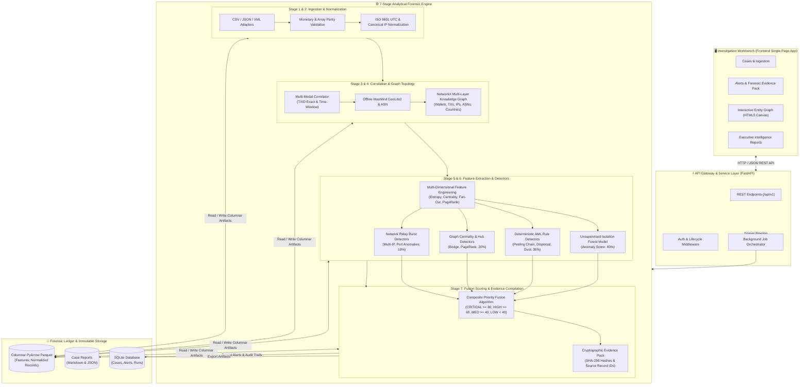

# 🛰️ Bitcoin Investigation & Forensic Intelligence Platform

> **An air-gapped, offline-first multi-modal intelligence platform for Bitcoin transaction graph analytics, P2P network telemetry correlation, and deterministic forensic AML investigation.**

[](https://www.python.org/downloads/release/python-3110/)
[](https://fastapi.tiangolo.com)
[](https://docs.pytest.org)
[]()
[]()

---

## 📑 Table of Contents

- [Overview](#-overview)
- [System Architecture & Visual Workflow](#-system-architecture--visual-workflow)
- [Key Capabilities & Innovations](#-key-capabilities--innovations)
- [Forensic Detection Engines & Scoring](#-forensic-detection-engines--scoring)
- [Interactive Investigation Workbench](#-interactive-investigation-workbench)
- [Project Directory Structure](#-project-directory-structure)
- [Installation & Quickstart Guide](#-installation--quickstart-guide)
  - [Prerequisites](#1-prerequisites)
  - [Method 1: Workspace Virtual Environment (Recommended)](#method-1-workspace-virtual-environment-recommended)
  - [Method 2: Conda Environment Setup](#method-2-conda-environment-setup)
  - [Database Initialization & Seeding](#step-3-database-initialization--seeding)
  - [Launching the Server](#step-4-launching-the-server)
  - [Troubleshooting & Common Questions](#troubleshooting--common-setup-tips)
- [Synthetic Dataset Generation](#-synthetic-dataset-generation)
- [Running Automated Tests](#-running-automated-tests)
- [REST API Reference](#-rest-api-reference)
- [Forensic Integrity & Chain of Custody](#-forensic-integrity--chain-of-custody)

---

## 🔍 Overview

The **Bitcoin Forensic Intelligence Platform** is built for law enforcement, blockchain intelligence analysts, and financial crime investigators. It fuses on-chain Bitcoin transaction graphs with off-chain P2P network observations (IPv4/IPv6, autonomous systems, geolocations, relay timestamps) to detect money laundering topologies, peeling chains, mixing hops, and anomalous broadcast patterns.

Designed under strict **air-gapped forensic requirements**:
- **100% Offline-First**: Zero external API dependencies, zero remote DNS/HTTP queries, and zero telemetry leakage.
- **Cryptographic Provenance**: Every alert, graph link, and report statement is cryptographically bound to raw dataset record IDs via SHA-256 hashes and columnar Parquet tables.
- **Deterministic Explainability**: Zero probabilistic hallucinations. Alerts present clear numerical thresholds, observed metrics, and exact rule criteria.

---

## 🏗️ System Architecture & Visual Workflow

Below is the complete end-to-end flowchart illustrating how data flows from ingestion to graph analytics, machine learning, scoring, and UI visualization:



---

## 🚀 Key Capabilities & Innovations

### 1. Multi-Modal Ingestion & Normalization
- Flexible parsing of **CSV, JSON, and XML** formats for transactions and network observations.
- Automatic column alias resolution (`txid`, `tx_hash`, `client_ip`, `src_ip`, etc.).
- Strict validation rules:
  - **Array parity checks**: Ensures inputs match input amounts and outputs match output amounts.
  - **Monetary conservation checks**: $\sum \text{inputs} = \sum \text{outputs} + \text{fee}$ (with tolerance for partial UTXO views).
  - **Sanitization**: Standardized ISO 8601 UTC timestamps and canonical IPv4/IPv6 addresses.

### 2. Multi-Modal Telemetry Correlation Engine
- **Exact TXID Correlation**: Instant correlation when network telemetry contains matching Bitcoin transaction hashes.
- **Time-Window Proximity Correlation**: Connects anonymous network observations to Bitcoin transactions occurring within sliding temporal windows ($\Delta t$).
- Records forensic correlation basis (`TXID_EXACT` vs. `TIME_WINDOW`) on all derived entity links.

### 3. Multi-Layer Forensic Entity Graph (NetworkX)
- Constructs a heterogeneous multi-layer knowledge graph:
  - **Nodes**: `wallet`, `transaction`, `ip`, `asn`, `country`
  - **Edges**: `SPENT_FROM`, `SENT_TO`, `RELAYED_BY`, `HOSTED_IN`, `LOCATED_IN`
- Computes on-the-fly topological metrics: PageRank, degree centrality, betweenness centrality, and Louvain community sizes.

### 4. Multi-Engine Anomaly Detection & Scoring
- **Unsupervised Isolation Forest**: Evaluates high-dimensional feature distributions (entropy, fan-out ratio, fee ratios, graph centrality) to isolate outlier entities without training labels.
- **Deterministic Forensic AML Rules**:
  - `RULE_PEELING_CHAIN`: Small incremental transfers peeled from a central balance.
  - `RULE_RAPID_DISPERSAL`: 1 input rapidly dispersed into dozens of child outputs.
  - `RULE_DUST_ATTACK`: Flood of sub-dust threshold outputs ($< 546$ satoshis).
  - `RULE_REPEATED_VALUE`: Repeated transfers with identical satoshi values.
  - `RULE_HIGH_FAN_OUT`: Extreme ratio of outputs to inputs ($> 10\times$).
  - `RULE_HIGH_FAN_IN`: Consolidation of multiple wallet inputs into a single address ($> 10\times$).
  - `RULE_FEE_ANOMALY`: Zero-fee transactions or exorbitant miner bribe fees.
- **Network Signals**: Multi-IP concurrent relay bursts, proxy/VPN/Tor port markers, and rapid ASN hopping.
- **Composite Fusion Scoring**:
  $$\text{Priority Score} = 0.40 \cdot S_{\text{anomaly}} + 0.30 \cdot S_{\text{behavior}} + 0.20 \cdot S_{\text{graph}} + 0.10 \cdot S_{\text{network}}$$
  Categorized into **CRITICAL** ($\ge 80$), **HIGH** ($\ge 60$), **MEDIUM** ($\ge 40$), and **LOW** ($< 40$) priority tiers.

---

## 📊 Forensic Detection Engines & Scoring

| Component | Weight | Forensic Basis | Target Threat Vectors |
|---|:---:|---|---|
| **Anomaly Engine** | `40%` | Unsupervised Isolation Forest on multi-dimensional numerical features | Unknown statistical outliers, zero-day dispersal patterns, non-standard UTXO structures |
| **Behavior Engine** | `30%` | Rule-based AML heuristic pattern matching | Peeling chains, mixer deposit/peel patterns, dust spam attacks, repeated value layering |
| **Graph Engine** | `20%` | PageRank, betweenness centrality, degree centrality, community clustering | Laundering bridges, money aggregation hubs, mule cluster intermediaries |
| **Network Engine** | `10%` | Concurrent multi-IP relay telemetry, ASN diversity, broadcast timing | Sybil broadcasts, multi-relay obfuscation, Tor/VPN exit hopping |

---

## 🖥️ Interactive Investigation Workbench

The platform includes a client-side single-page interface:

1. **Cases & Ingestion Tab**:
   - Case creation and metadata management.
   - Dual-zone drag-and-drop file uploader for Bitcoin transactions and network telemetry.
   - 1-click **Pre-Packaged Synthetic Demo Datasets** loader (1,000 transactions and 1,000 network observations).
   - Real-time pipeline modal tracker displaying live progress across all 7 execution stages.

2. **Forensic Leads & Evidence Tab**:
   - Prioritized alerts table with severity filters (`CRITICAL`, `HIGH`, `MEDIUM`, `LOW`, `ALL`).
   - Monospaced entity address cards with instant "Investigate" pivot buttons.
   - **Forensic Evidence Pack Drawer**:
     - 4 score breakdown cards displaying raw scores, weighted points contribution (e.g. `+40.0 pts`), and progress meters.
     - Deterministic finding cards displaying rule codes, human-readable explanations, observed values, and thresholds.
     - **Cryptographic Chain of Custody**: SHA-256 verified badges displaying all linked source dataset record IDs (`tx-rec-000051`, etc.) with pagination and 1-click clipboard copy.

3. **Forensic Entity Graph Tab**:
   - High-performance HTML5 Canvas visualizer supporting 1,000+ simultaneous nodes.
   - **Physics & Layouts**:
     - *Force-Directed*: Fruchterman-Reingold spring physics with collision boundary repulsion ($r_1 + r_2 + 36\text{px}$).
     - *Flow / Sankey*: 4-tier structured layout (`Inputs` $\to$ `Transactions` $\to$ `Outputs` $\to$ `Relays`).
     - *Community Clusters*: Isolates connected subgraphs into distinct orbital clusters.
   - **Navigation & Controls**:
     - Interactive Zoom suite (`+`, `−`, `100%` badge, `⟲ Fit`, smooth mouse wheel zoom centered at cursor).
     - Full-text search for addresses, TXIDs, or IPs with auto-centering camera glide.
     - Node type filtering pills (`All`, `Wallets`, `TXs`, `IPs`, `⚠️ Flagged Only`).
   - **Click-to-Inspect Drawer**:
     - Pulsing golden halo ring on selected node; 1-hop connected neighbors illuminated while unrelated nodes dim to 12% opacity.
     - Displays wallet balances, transaction counts, mining fees, script types, and connected peers.
     - Action buttons: `Focus Node`, `Isolate 1-Hop Ego`, `View Evidence Pack`, `Copy ID`.

4. **Forensic Intelligence Reports Tab**:
   - Automatically generates executive investigation reports in Markdown format.
   - Built-in Markdown renderer supporting structured headers, statistical data tables, and risk metrics.
   - 1-click export to **Markdown (.md)** or **JSON (.json)** for court submission and chain-of-custody documentation.

---

## 📁 Project Directory Structure

```text
Bitcoin-Investigation-platform/
├── backend/
│   ├── app/
│   │   ├── api/
│   │   │   ├── deps.py               # Dependency injection & offline mock auth
│   │   │   └── v1/
│   │   │       ├── alerts.py         # Alerts & evidence pack API endpoints
│   │   │       ├── cases.py          # Case lifecycle management
│   │   │       ├── datasets.py       # Dataset upload & validation endpoints
│   │   │       ├── graph.py          # Entity graph serialization & ego subgraphs
│   │   │       ├── reports.py        # Forensic markdown/JSON report generator
│   │   │       ├── runs.py           # Pipeline execution & status polling
│   │   │       └── wallets.py        # Unified entity inspector (wallets, TXs, IPs)
│   │   ├── core/
│   │   │   ├── config.py             # Settings (Dynamic paths, OFFLINE_MODE, weights)
│   │   │   └── logging.py            # Structured JSON logging
│   │   ├── db/
│   │   │   ├── base.py               # SQLAlchemy metadata registration
│   │   │   ├── models.py             # Case, Dataset, AnalysisRun, Alert ORM models
│   │   │   └── session.py            # SQLite session factory
│   │   ├── schemas/                  # Pydantic validation schemas
│   │   ├── services/
│   │   │   ├── detectors/            # Isolation Forest, AML rules, network signals
│   │   │   ├── ingestion/            # Field mapping, CSV/JSON/XML adapters, normalization
│   │   │   ├── correlation.py        # Multi-modal exact & temporal correlation
│   │   │   ├── evidence.py           # Provenance compilation & chain of custody
│   │   │   ├── features.py           # Transaction, wallet, graph, network features
│   │   │   ├── geoip.py              # MaxMind GeoLite2 offline reader (graceful fallback)
│   │   │   ├── graph_builder.py      # NetworkX entity graph construction
│   │   │   ├── job_manager.py        # Background asynchronous execution manager
│   │   │   ├── pipeline.py           # End-to-end 7-stage analytical pipeline
│   │   │   ├── report.py             # Forensic report builder
│   │   │   └── scoring.py            # Composite priority fusion algorithm
│   │   └── storage/
│   │       ├── case_store.py         # Directory management (raw/, features/, reports/)
│   │       ├── file_store.py         # Raw file storage with SHA-256 integrity
│   │       └── parquet_store.py      # PyArrow columnar read/write engine
│   ├── main.py                       # FastAPI application entrypoint & static mount
│   └── tests/                        # Pytest automated test suites
├── data/
│   ├── cases/                        # Case execution artifacts (Parquet, models, reports)
│   └── samples/                      # 1,000-record synthetic ground truth test datasets
├── frontend/
│   ├── index.html                    # Single-page investigation workbench UI
│   └── static/
│       ├── app.js                    # Graph visualizer, UI controllers, API client
│       └── style.css                 # Dark-mode forensic theme styles
├── scripts/
│   ├── generate_1000_datasets.py     # Generates 1,000 transactions & network observations
│   ├── generate_synthetic.py         # Base synthetic dataset generator
│   └── seed_admin.py                 # Seeds default case & administrator credentials
├── environment.yml                   # Conda environment specifications
├── requirements.txt                  # Standard pip dependencies specification
├── .gitignore                        # Git exclusion rules
└── README.md                         # Comprehensive platform documentation
```

---

## ⚡ Installation & Quickstart Guide

The platform uses **dynamic path resolution** (`BASE_DIR = Path(__file__).resolve().parent...`), meaning it runs out-of-the-box on **Windows, macOS, or Linux** on any drive (`C:`, `D:`, etc.) without editing a single line of code.

### 1. Prerequisites

- **Python 3.10 or 3.11** installed. Check your version:
  ```bash
  python --version
  ```
- **Git** installed for cloning.

---

### Method 1: Workspace Virtual Environment (Recommended)

Installing inside an isolated `venv` folder within the workspace ensures packages do not conflict with other system libraries.

#### Step 1: Clone the Repository
```bash
git clone https://github.com/Sampath-rgb-create/Bitcoin-Investigation-platform.git
cd Bitcoin-Investigation-platform
```

#### Step 2: Create the Virtual Environment
```bash
# Creates an isolated ./venv folder inside the project
python -m venv venv
```

#### Step 3: Activate the Virtual Environment
- **On Windows (PowerShell)**:
  ```powershell
  .\venv\Scripts\activate
  ```
- **On Windows (Command Prompt `cmd`)**:
  ```cmd
  venv\Scripts\activate.bat
  ```
- **On macOS / Linux**:
  ```bash
  source venv/bin/activate
  ```

*(You will see `(venv)` appear in front of your terminal prompt).*

#### Step 4: Install Dependencies
```bash
pip install -r requirements.txt
```

---

### Method 2: Conda Environment Setup

If you prefer using **Miniconda** or **Anaconda**, you can create the environment directly from `environment.yml`:

```bash
# 1. Clone & enter repository
git clone https://github.com/Sampath-rgb-create/Bitcoin-Investigation-platform.git
cd Bitcoin-Investigation-platform

# 2. Create and activate environment
conda env create -f environment.yml
conda activate btc-intel
```

---

### Step 3: Database Initialization & Seeding

Run the seed script to initialize SQLite database tables and set up default case metadata:

```bash
python scripts/seed_admin.py
```

*What this does*: Creates `data/app.db` with all ORM tables (`cases`, `datasets`, `analysis_runs`, `alerts`) and registers the default administrator account.

---

### Step 4: Launching the Server

Run Uvicorn to start the application:

```bash
python -m uvicorn backend.app.main:app --host 127.0.0.1 --port 8000 --reload
```

Open your browser to:
👉 **`http://localhost:8000`** (or `http://127.0.0.1:8000`)

---

### 💡 Troubleshooting & Common Setup Tips

1. **PowerShell `Script Execution` Error on Windows**:
   If PowerShell displays `running scripts is disabled on this system` when running `activate`, run this command once in PowerShell:
   ```powershell
   Set-ExecutionPolicy -Scope Process -ExecutionPolicy Bypass
   ```
   Then run `.\venv\Scripts\activate` again.

2. **Port 8000 Already in Use**:
   If another application is using port 8000, start Uvicorn on another port (e.g. 8080):
   ```bash
   python -m uvicorn backend.app.main:app --host 127.0.0.1 --port 8080 --reload
   ```

---

## 🧪 Synthetic Dataset Generation

To generate comprehensive forensic datasets featuring ground-truth AML anomalies (peeling chains, mixer dispersals, dust attacks, multi-IP relays):

```powershell
# Generates 1,000 transactions and 1,000 network telemetry observations
python scripts/generate_1000_datasets.py
```

This outputs ready-to-ingest datasets under `data/samples/`:
- `transactions_1000.csv`
- `network_telemetry_1000.csv`
- `combined_1000.csv`
- `ground_truth_1000.json`

---

## 🛡️ Running Automated Tests

Run the full pytest suite to verify all pipeline components, adapters, detectors, and storage engines:

```powershell
python -m pytest backend/tests -v
```

Expected result:
```text
============================= 25 passed in 5.24s ==============================
```

---

## 📡 REST API Reference

The backend provides a RESTful API compliant with OpenAPI 3.0:

| Method | Endpoint | Description |
|---|---|---|
| `GET` | `/api/v1/cases` | List all investigation cases |
| `POST` | `/api/v1/cases` | Create a new investigation case |
| `POST` | `/api/v1/cases/{case_id}/datasets/upload` | Upload CSV/JSON/XML transaction or telemetry files |
| `POST` | `/api/v1/cases/{case_id}/runs` | Execute the end-to-end analysis pipeline |
| `GET` | `/api/v1/cases/{case_id}/runs/{run_id}` | Poll pipeline progress and stage status |
| `GET` | `/api/v1/cases/{case_id}/alerts` | Retrieve prioritized forensic alerts and scores |
| `GET` | `/api/v1/cases/{case_id}/alerts/{alert_id}/evidence` | Fetch complete evidence pack and provenance record IDs |
| `GET` | `/api/v1/cases/{case_id}/graph?limit=250` | Retrieve serialized entity graph (nodes and edges) |
| `GET` | `/api/v1/cases/{case_id}/graph/neighborhood/{id}` | Extract 1-hop ego network subgraph for a specific node |
| `GET` | `/api/v1/cases/{case_id}/entities/{entity_id}` | Unified inspector lookup for wallet, TXID, or IP entity |
| `GET` | `/api/v1/cases/{case_id}/report?format=markdown` | Download executive forensic report (Markdown or JSON) |

Interactive Swagger documentation is available locally at:
👉 **`http://localhost:8000/docs`**

---

## 🔒 Forensic Integrity & Chain of Custody

1. **SHA-256 Dataset Hashing**: Every uploaded raw file is hashed prior to processing. Hashes are permanently recorded in SQLite and Parquet metadata.
2. **Deterministic Offline Execution**: The pipeline sets explicit random seeds (`random_state=42`) across scikit-learn models, guaranteeing bit-for-bit reproducible results across repeated runs.
3. **Columnar Immutability**: Intermediate features and normalized records are persisted in PyArrow Parquet format with Snappy compression, preventing accidental mutation.
4. **Court-Ready Evidence Export**: Evidence packs link specific forensic findings (e.g. `RULE_HIGH_FAN_OUT: 60 outputs`) to exact source record IDs (`tx-rec-000051` to `tx-rec-000110`), establishing an unbroken chain of custody.

---

## 📄 License

This project is licensed under the Apache 2.0 License - see the LICENSE file for details.
