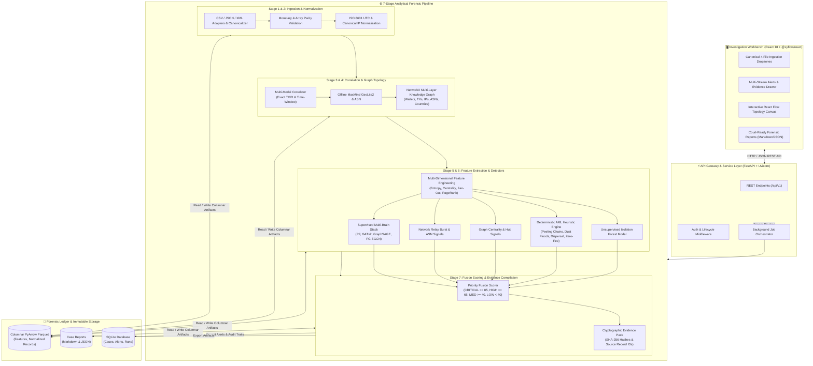

# 🛰️ Bitcoin Investigation & Forensic Intelligence Platform

> **An air-gapped, offline-first multi-modal intelligence platform for Bitcoin transaction graph analytics, P2P network telemetry correlation, and deterministic forensic AML investigation.**

[](https://www.python.org/downloads/release/python-3110/)
[](https://fastapi.tiangolo.com)
[](https://react.dev/)
[](https://reactflow.dev/)
[](https://docs.pytest.org)
[]()
[]()

---

## 📑 Table of Contents

- [Overview](#-overview)
- [System Architecture & Visual Workflow](#-system-architecture--visual-workflow)
- [Key Capabilities & Innovations](#-key-capabilities--innovations)
- [Multi-Brain AI/ML Models & Detection Engines](#-multi-brain-aiml-models--detection-engines)
- [Interactive React Investigation Workbench](#-interactive-react-investigation-workbench)
- [Project Directory Structure](#-project-directory-structure)
- [⚡ Complete End-to-End Installation & Quickstart](#-complete-end-to-end-installation--quickstart)
  - [1. Prerequisites](#1-prerequisites)
  - [2. Clone the Repository](#2-clone-the-repository)
  - [3. Environment Setup (Python Virtual Environment)](#3-environment-setup-python-virtual-environment)
  - [4. Install Python Dependencies](#4-install-python-dependencies)
  - [5. How Pre-Trained AI/ML Models Are Included](#5-how-pre-trained-aiml-models-are-included)
  - [6. Offline GeoIP Database Setup](#6-offline-geoip-database-setup)
  - [7. Frontend Dashboard Setup (Pre-Compiled & Source)](#7-frontend-dashboard-setup-pre-compiled--source)
  - [8. Initialize SQLite Database & Seed Data](#8-initialize-sqlite-database--seed-data)
  - [9. Launching the Server](#9-launching-the-server)
- [Synthetic Dataset Generation & Ground Truth](#-synthetic-dataset-generation--ground-truth)
- [Running Automated Verification & Tests](#-running-automated-verification--tests)
- [REST API Reference](#-rest-api-reference)
- [Forensic Integrity & Chain of Custody](#-forensic-integrity--chain-of-custody)
- [Repository Access & Read-Only Notice](#-repository-access--read-only-notice)

---

## 🔍 Overview

The **Bitcoin Forensic Intelligence Platform** is engineered for law enforcement agencies, cybercrime task forces, blockchain intelligence analysts, and financial crime compliance units. It bridges the gap between on-chain Bitcoin transaction ledgers and off-chain P2P network telemetry (IPv4/IPv6, autonomous systems, geolocations, relay timing) to detect money laundering typologies, peeling chains, mixer dispersals, botnet dust floods, and zero-fee miner collusions.

### Strict Air-Gapped Forensic Principles:
- **100% Offline-First**: Zero external API dependencies, zero remote DNS/HTTP telemetry, zero cloud LLM callbacks. Runs natively on isolated Linux or Windows workstations.
- **Cryptographic Provenance**: Every alert, graph link, and report finding is cryptographically bound to raw dataset record IDs via SHA-256 hashes and columnar PyArrow Parquet tables.
- **Deterministic Explainability**: Zero probabilistic hallucinations. Alerts present exact numerical thresholds, observed metrics, case median baselines, and triggered AML rule codes.

---

## 🏗️ System Architecture & Visual Workflow


```mermaid
flowchart TD
    subgraph UI ["🖥️ Investigation Workbench (React 18 + @xyflow/react)"]
        direction LR
        TAB1["Canonical 4-File Ingestion Dropzones"]
        TAB2["Multi-Stream Alerts & Evidence Drawer"]
        TAB3["Interactive React Flow Topology Canvas"]
        TAB4["Court-Ready Forensic Reports (Markdown/JSON)"]
    end

    subgraph API ["⚡ API Gateway & Service Layer (FastAPI + Uvicorn)"]
        direction LR
        ROUTER["REST Endpoints (/api/v1)"]
        DEPS["Auth & Lifecycle Middleware"]
        JOB["Background Job Orchestrator"]
    end

    subgraph PIPELINE ["⚙️ 7-Stage Analytical Forensic Pipeline"]
        direction TB
        subgraph S1 ["Stage 1 & 2: Ingestion & Normalization"]
            ING["CSV / JSON / XML Adapters & Canonicalizer"] --> VAL["Monetary & Array Parity Validation"]
            VAL --> NORM["ISO 8601 UTC & Canonical IP Normalization"]
        end

        subgraph S2 ["Stage 3 & 4: Correlation & Graph Topology"]
            CORR["Multi-Modal Correlator\n(Exact TXID & Time-Window)"] --> GEO["Offline MaxMind GeoLite2 & ASN"]
            GEO --> GRAPH["NetworkX Multi-Layer Knowledge Graph\n(Wallets, TXs, IPs, ASNs, Countries)"]
        end

        subgraph S3 ["Stage 5 & 6: Feature Extraction & Detectors"]
            FEAT["Multi-Dimensional Feature Engineering\n(Entropy, Centrality, Fan-Out, PageRank)"] --> IFOREST["Unsupervised Isolation Forest Model"]
            FEAT --> AML["Deterministic AML Heuristic Engine\n(Peeling Chains, Dust Floods, Dispersal, Zero-Fee)"]
            FEAT --> TOPO["Graph Centrality & Hub Signals"]
            FEAT --> NET["Network Relay Burst & ASN Signals"]
            FEAT --> ML["Supervised Multi-Brain Stack\n(RF, GATv2, GraphSAGE, FG-EGCN)"]
        end

        subgraph S4 ["Stage 7: Fusion Scoring & Evidence Compilation"]
            IFOREST & AML & TOPO & NET & ML --> FUSION["Priority Fusion Scorer\n(CRITICAL >= 85, HIGH >= 65, MED >= 40, LOW < 40)"]
            FUSION --> PACK["Cryptographic Evidence Pack\n(SHA-256 Hashes & Source Record IDs)"]
        end
    end

    subgraph STORAGE ["💾 Forensic Ledger & Immutable Storage"]
        direction LR
        SQLITE[("SQLite Database\n(Cases, Alerts, Runs)")]
        PARQUET[("Columnar PyArrow Parquet\n(Features, Normalized Records)")]
        REPORTS[("Case Reports\n(Markdown & JSON)")]
    end

    UI <-->|HTTP / JSON REST API| API
    API -->|Trigger Pipeline| JOB
    JOB --> PIPELINE
    S1 --> S2 --> S3 --> S4
    S1 & S2 & S3 & S4 <-->|Read / Write Columnar Artifacts| PARQUET
    S4 -->|Persist Alerts & Audit Trails| SQLITE
    S4 -->|Export Artifacts| REPORTS
```

---

## 🚀 Key Capabilities & Innovations

### 1. Canonical Multi-File Ingestion & Validation
- Fully supports both **canonical 4-file ingestion** (`transactions.csv`, `inputs.csv`, `outputs.csv`, `network.csv`) and legacy combined datasets (CSV, JSON, XML).
- Strict validation checks:
  - **Array parity**: Input addresses match input amounts; output addresses match output amounts.
  - **Monetary conservation**: $\sum \text{inputs} = \sum \text{outputs} + \text{fee}$ with configurable floating-point epsilon.
  - **Format normalization**: Standardized ISO-8601 UTC timestamps, lowercase hex TXIDs, and clean IPv4/IPv6 addresses.

### 2. Multi-Modal Correlation Engine
- **Exact TXID Correlation**: Instant mapping when network observations share on-chain Bitcoin transaction hashes.
- **Time-Window Proximity Correlation**: Connects unlinked network telemetry to Bitcoin transactions broadcast within sliding temporal windows ($\Delta t$).
- Records forensic correlation basis (`TXID_EXACT` vs. `TIME_WINDOW`) and microsecond `time_delta_ms` on all derived entity links.

### 3. Multi-Layer Knowledge Graph (NetworkX)
- Constructs a heterogeneous directed graph:
  - **Nodes**: `wallet`, `transaction`, `ip`, `asn`, `country`
  - **Edges**: `SPENT_FROM`, `SENT_TO`, `RELAYED_BY`, `HOSTED_IN`, `LOCATED_IN`
- Automatically computes PageRank, in/out degree centrality, betweenness centrality, short circular loop detection (2–4 hops), and community density.

### 4. Deterministic AML Heuristics & Behavioral Rules
- `RULE_PEELING_CHAIN`: Detects sequential laundering chains stripping small peel payments while forwarding major change.
- `RULE_RAPID_DISPERSAL`: Identifies sudden 1-to-many fan-out fund splits across dozens of counterparties.
- `RULE_DUST_ATTACK`: Detects botnet micro-transfer floods below the Bitcoin dust threshold ($< 546$ satoshis).
- `RULE_REPEATED_VALUE`: Flags structured transfers with identical satoshi values.
- `RULE_FEE_ANOMALY`: Detects zero-fee miner collusion transfers or exorbitant priority bribes.
- `RULE_HIGH_FAN_OUT` & `RULE_HIGH_FAN_IN`: Uncovers extreme split or consolidation ratios ($> 10\times$).

---

## 🧠 Multi-Brain AI/ML Models & Detection Engines

The platform does not rely on a single model. It deploys a hybrid multi-domain stack:

| Model Layer | Architecture / Framework | Input Dimensionality | Purpose |
|---|---|:---:|---|
| **Unsupervised Outlier Engine** | **Isolation Forest** (scikit-learn) | 55-dim features | Detects statistical outliers and unknown laundering topologies without pre-labeled data. |
| **Transaction Brain** | **Random Forest** + **GATv2** + **FG-EGCN** (PyTorch) | 182-dim features | Classifies transaction-level risk using local and relational topological embeddings. |
| **Wallet Brain** | **Actor Random Forest** + **GraphSAGE** + **FG-EGCN** | 55-dim features | Evaluates entity-level velocity, fan-in/fan-out ratios, and circular flow structures. |
| **Network Brain** | **Random Forest** + **GraphSAGE** + **TGAT** | 13-dim features | Flags multi-IP concurrent relays, ASN hopping, and port anomalies. |
| **Meta-Stacking Fusion** | **L2 Stacker & Priority Fusion** | Ensemble | Synthesizes all detector streams into a transparent composite risk score (0–100%). |

### Severity Tier Thresholds:
- **CRITICAL**: Priority Score $\ge 85.0$ (Sanction hits, confirmed botnet originators)
- **HIGH**: Priority Score $\ge 65.0$ (High-probability ML hits, zero-fee collusion, peeling chain originators)
- **MEDIUM**: Priority Score $\ge 40.0$ (Statistical deviations, high fan-in/out)
- **LOW**: Priority Score $< 40.0$ (Baseline monitoring)

---

## 🖥️ Interactive React Investigation Workbench

Built with **React 18, TypeScript, Tailwind CSS, and `@xyflow/react`**:

1. **Dataset Ingestion Suite**:
   - Drag-and-drop dropzones for `transactions.csv`, `inputs.csv`, `outputs.csv`, and `network.csv`.
   - Real-time row counting, format validation, and attached dataset status indicators.
2. **Alerts & Evidence Workbench**:
   - High-density forensic summary cards (`Total Flagged`, `Critical`, `High ML Hits`, `Medium Risk`).
   - Interactive stream switcher pills:
     `[🎯 Composite Ensemble | 🧠 Supervised ML | 🔍 Unsupervised (IF) | 🕸️ Graph Flow | ⚖️ Custom Rules]`.
   - Ranked alerts table with dynamic sorting by active stream score.
   - **Slide-over Evidence Drawer**: Displays transparent score bars, natural language narrative explanation, feature deviation charts, and raw source record IDs with one-click clipboard copy.
3. **Interactive React Flow Topology Canvas**:
   - Directed visual money flow between wallets, transactions, and relay IPs.
   - Left-to-right DAG layout with animated risk-weighted edges.
   - Click-to-inspect drawer showing node degree, balance, PageRank, and connected counterparties.
4. **Dynamic Rules Manager**:
   - Allows investigators to create custom rules on the fly (e.g. `fan_out > 10`, `fee == 0`) with custom severity and weight.
5. **Court-Ready Reports**:
   - Automatically renders structured executive investigation reports with Markdown and JSON download options.

---

## 📁 Project Directory Structure

```text
Bitcoin-Investigation-platform/
├── backend/
│   ├── app/
│   │   ├── api/
│   │   │   └── v1/
│   │   │       ├── alerts.py         # Paginated alerts & latest run scoping
│   │   │       ├── cases.py          # Case lifecycle management
│   │   │       ├── datasets.py       # Dataset upload & validation endpoints
│   │   │       ├── graph.py          # Entity graph serialization & neighborhood inspection
│   │   │       ├── reports.py        # Executive forensic report generation
│   │   │       ├── rules.py          # Dynamic investigator custom rules
│   │   │       └── runs.py           # Pipeline execution & status polling
│   │   ├── core/                     # Configuration, logging & error handlers
│   │   ├── db/                       # SQLAlchemy models & SQLite session factory
│   │   ├── services/
│   │   │   ├── detectors/            # Isolation Forest, AML rules, graph & network signals
│   │   │   ├── ingestion/            # Field mapping, CSV/JSON/XML adapters, validation
│   │   │   ├── new_pipeline/         # Canonicalizer & strict InputValidator
│   │   │   ├── correlation.py        # Multi-modal exact & temporal correlation engine
│   │   │   ├── evidence.py           # Provenance compilation & chain of custody
│   │   │   ├── features.py           # 335-dimensional multi-domain feature engine
│   │   │   ├── geoip.py              # Offline MaxMind GeoLite2 reader with fallback
│   │   │   ├── graph_builder.py      # NetworkX entity graph construction
│   │   │   ├── ml_inference.py       # Multi-Brain PyTorch & scikit-learn inference engine
│   │   │   ├── pipeline.py           # End-to-end analytical pipeline orchestrator
│   │   │   └── scoring.py            # Priority fusion scoring algorithm
│   │   └── storage/                  # Parquet & case directory storage managers
│   └── main.py                       # FastAPI application & compiled React static server
├── data/
│   ├── app.db                        # SQLite database (auto-created on seed)
│   ├── cases/                        # Case run directories (features/, reports/, graph/)
│   └── samples/                      # Canonical synthetic datasets & ground truth catalog
│       ├── transactions.csv          # 180 on-chain Bitcoin transactions
│       ├── inputs.csv                # 180 input UTXO references (vin)
│       ├── outputs.csv               # 362 output scripts & amounts (vout)
│       ├── network.csv               # 171 network P2P telemetry records
│       ├── ground_truth.json         # Complete ground-truth labels for 38 illicit targets
│       └── ground_truth.md           # Human-readable ground truth documentation
├── docs/
│   ├── YOUTUBE_DEMO_SCRIPT.md        # Complete 5-7 minute video presentation script
│   └── DATABASE_ARCHITECTURE.md      # Storage & schema specifications
├── frontend-react/                   # Modern React 18 + Vite + Tailwind dashboard
│   ├── dist/                         # Pre-compiled production bundle (served by FastAPI)
│   ├── src/                          # TypeScript source components & React Flow canvas
│   └── package.json                  # Frontend dependencies
├── models/                           # Pre-trained ML weights (PyTorch .pt & joblib)
│   ├── fusion/                       # OOF Meta-stacker & calibration matrices
│   ├── network/                      # Network GraphSAGE, TGAT, Isolation Forest, RF
│   ├── transaction/                  # Transaction GATv2, FG-EGCN, Isolation Forest, RF
│   └── wallet/                       # Wallet Actor RF, GraphSAGE, FG-EGCN, Isolation Forest
├── scripts/
│   ├── generate_synthetic.py         # Ground-truth synthetic dataset generator
│   ├── package_models.py             # Model bundle packaging & verification CLI
│   └── seed_admin.py                 # SQLite database initialization & case seeding
├── requirements.txt                  # Python dependencies
└── README.md                         # This documentation
```

---

## ⚡ Complete End-to-End Installation & Quickstart

The platform uses **dynamic path resolution** throughout the backend (`Path(__file__).resolve().parent...`), meaning it operates out-of-the-box on **Windows or Linux** without modifying any code or path variables.

### 1. Prerequisites
- **Python 3.10 or 3.11** (Python 3.11 recommended). Verify:
  ```bash
  python --version
  ```
- **Git** installed on your system.

---

### 2. Clone the Repository
```bash
git clone https://github.com/Sampath-rgb-create/Bitcoin-Investigation-platform.git
cd Bitcoin-Investigation-platform
```

---

### 3. Environment Setup (Python Virtual Environment)

#### Option A: Python `venv` (Standard - Recommended)
```bash
# Create an isolated virtual environment
python -m venv venv

# Activate on Linux / macOS:
source venv/bin/activate

# Activate on Windows (PowerShell):
.\venv\Scripts\activate

# Activate on Windows (Command Prompt):
venv\Scripts\activate.bat
```

#### Option B: Conda Environment
```bash
conda create -n btc-intel python=3.11 -y
conda activate btc-intel
```

---

### 4. Install Python Dependencies
```bash
pip install --upgrade pip
pip install -r requirements.txt
```

---

### 5. How Pre-Trained AI/ML Models Are Included

All required model architectures, neural weights, and meta-stackers are **already tracked and included directly inside the repository** under [`models/`](file:///d:/Bitcoin-Investigation-platform/models/):

- `models/transaction/` (`gatv2.pt`, `fgecgn.pt`, `rf.joblib`, `isolation_forest.joblib`)
- `models/wallet/` (`actor_rf.joblib`, `graphsage.pt`, `fgecgn.pt`, `isolation_forest.joblib`)
- `models/network/` (`graphsage.pt`, `tgat.pt`, `rf.joblib`, `isolation_forest.joblib`)
- `models/fusion/` (`oof_meta_stacker.joblib`, `calibration.json`, `threshold.json`)

**No separate download is necessary.** 

#### Verifying Model Integrity:
To verify that all 16 model files are present and ready for offline inference, run the verification CLI:
```bash
python scripts/package_models.py --verify
```
*Expected output: `✓ Verification successful: All models, architectures, and calibrations are intact.`*

---

### 6. Offline GeoIP Database Setup
The platform is built to operate **100% offline**:
- It includes a native offline MaxMind GeoLite2 reader ([`GeoIPService`](file:///d:/Bitcoin-Investigation-platform/backend/app/services/geoip.py)).
- If you have a local `GeoLite2-City.mmdb` or `GeoLite2-ASN.mmdb` file, place it in `data/geoip/` or configure the path in `.env`.
- If no `.mmdb` file is present, the system employs **graceful degradation** — it automatically defaults IP locations to `UNKNOWN` with zero crashes and zero external network calls.

---

### 7. Frontend Dashboard Setup (Pre-Compiled & Source)

#### Pre-Compiled Production Build (Instant Plug-and-Play)
The repository already includes the **pre-compiled production bundle** in [`frontend-react/dist/`](file:///d:/Bitcoin-Investigation-platform/frontend-react/dist/). The FastAPI backend automatically serves this bundle at the root URL (`http://127.0.0.1:8000/`).

> **You do NOT need Node.js or npm installed just to run and evaluate the dashboard.**

#### Optional: Building Frontend from Source
If you wish to modify the React source code:
```bash
cd frontend-react
npm install
npm run build
cd ..
```

---

### 8. Initialize SQLite Database & Seed Data
Initialize the database tables and register the default demo investigation case:

```bash
python scripts/seed_admin.py
```

*What this does:*
- Creates `data/app.db` with all required tables (`cases`, `datasets`, `analysis_runs`, `alerts`, `custom_rules`).
- Seeds the initial demo investigation dossier with the pre-attached canonical 4-file dataset.

---

### 9. Launching the Server

Start the platform via Uvicorn:

```bash
python -m uvicorn backend.app.main:app --host 127.0.0.1 --port 8000 --reload
```

Open your browser and navigate to:
👉 **`http://127.0.0.1:8000`** (or `http://localhost:8000`)

- **Interactive Forensic Dashboard**: `http://127.0.0.1:8000/`
- **Interactive OpenAPI / Swagger Documentation**: `http://127.0.0.1:8000/docs`

---

## 🧪 Synthetic Dataset Generation & Ground Truth

The repository comes pre-loaded with an exact benchmark dataset in `data/samples/`. To regenerate or produce fresh datasets with known ground truth:

```bash
python scripts/generate_synthetic.py
```

### Planted Ground-Truth Typologies:
- **Total Transactions**: 180 (150 Licit, 30 Illicit).
- **Planted Illicit Targets**: Exactly **38** (documented in [`data/samples/ground_truth.md`](file:///d:/Bitcoin-Investigation-platform/data/samples/ground_truth.md)):
  - **Peeling Chain (8 hops)**: Originator `bc1q_peel_master_source_...` peeling 0.75 BTC per hop.
  - **Dust Flood Attack (20 txs)**: Controller `bc1q_dust_botnet_origin_...` transmitting sub-dust amounts at 2.86 tx/sec.
  - **Rapid Dispersal (1 tx, 25 outputs)**: Launderer `bc1q_dispersal_launderer_...` splitting funds across 25 child addresses.
  - **Zero-Fee Collusion (1 whale tx)**: `tx_illicit_zerofee_collusion_001` transferring 15.0 BTC with 0 miner fee.
  - **4 Bulletproof / Tor Relay IPs**: `185.220.101.5`, `185.220.101.7`, `194.26.29.112`, `45.154.255.89`.

---

## 🛡️ Running Automated Verification & Tests

Run the complete test suite to verify ingestion, correlation, graph building, ML inference, and analytical scoring:

```bash
python -m pytest backend/tests -v
```

*Expected test suite output:*
```text
======================= 36 passed in 18.77s =======================
```

---

## 📡 REST API Reference

| Method | Endpoint | Description |
|---|---|---|
| `GET` | `/api/v1/cases` | List all investigation case dossiers |
| `POST` | `/api/v1/cases` | Create a new case dossier |
| `POST` | `/api/v1/cases/{case_id}/datasets/upload` | Upload CSV/JSON/XML transaction or telemetry files |
| `POST` | `/api/v1/cases/{case_id}/runs` | Trigger the end-to-end analytical pipeline |
| `GET` | `/api/v1/cases/{case_id}/runs/{run_id}` | Poll pipeline execution stage and progress (0-100%) |
| `GET` | `/api/v1/cases/{case_id}/alerts` | Retrieve prioritized alerts (scoped to active run) |
| `GET` | `/api/v1/cases/{case_id}/alerts/{alert_id}/evidence` | Fetch cryptographic evidence pack and raw record IDs |
| `GET` | `/api/v1/cases/{case_id}/graph?limit=250` | Retrieve serialized entity graph (nodes, edges, stats) |
| `GET` | `/api/v1/cases/{case_id}/graph/neighborhood/{id}` | Extract 1-hop ego network subgraph for a specific node |
| `GET` | `/api/v1/cases/{case_id}/rules` | List active custom investigator behavioral rules |
| `POST` | `/api/v1/cases/{case_id}/rules` | Create a new investigator dynamic rule |
| `GET` | `/api/v1/cases/{case_id}/report?format=markdown` | Download executive forensic report (Markdown or JSON) |

---

## 🔒 Forensic Integrity & Chain of Custody

1. **SHA-256 Dataset Hashing**: All uploaded raw files are cryptographically hashed upon receipt. Hashes are permanently recorded in SQLite and Parquet metadata.
2. **Deterministic Reproducibility**: Random states (`random_state=42`) are strictly pinned across all scikit-learn models and PyTorch initializations, guaranteeing identical scores on identical datasets.
3. **Columnar Immutability**: Intermediate features and canonical tables are saved in PyArrow Parquet format with Snappy compression to prevent accidental mutation.
4. **Court-Admissible Evidence Packs**: Every alert explicitly lists `source_record_ids` and transaction hashes, establishing an unbroken chain of custody.

---

## 👁️ Repository Access & Read-Only Notice

- **Public Repository**: This repository is publicly viewable for evaluation, benchmarking, and review.
- **Read-Only / Pull Request Policy**: Direct pushes to `main` are restricted to maintain forensic reproducibility. Third-party contributors are welcome to clone, inspect, and submit pull requests for enhancements.

---

## 📄 License

This project is licensed under the Apache 2.0 License - see the LICENSE file for details.
