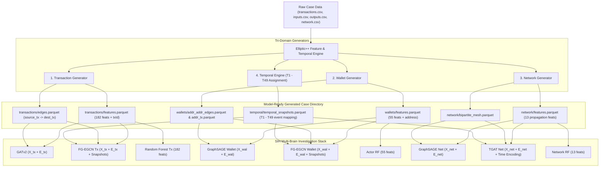

# Elliptic++ Feature Generator & Temporal Graph Engine Specification
**Project:** AI-Powered Monitoring & Analysis of Bitcoin Transaction Traffic (SIH26146)  
**System Target:** `Bitcoin-Investigation-platform`  
**Status:** Canonical Implementation Blueprint (Replaces arbitrary 85-feature catalog)  
**Primary Reference:** Official Elliptic++ Repository & ACM SIGKDD '23 Paper (Elmougy & Liu, Georgia Tech)

---

## 1. Executive Summary & Clarification

We do **not** invent an arbitrary 85-feature vector or synthesize artificial "temporal feature columns" that do not exist in the official Elliptic++ benchmark.

Instead, the **Elliptic++ Feature Engine** produces three distinct, model-ready artifacts:
1. **The Exact Elliptic++ Node Features**:
   - **Transaction Features**: Exactly **182 features** (`LF_1`–`LF_93` local features, `AF_1`–`AF_72` 1-hop aggregate features, and 17 graph-theoretic/financial features: degree, amounts, fees, size, address counts). Plus `txId` and `Time step` = 184 columns in `txs_features.csv`.
   - **Wallet / Actor Features**: Exactly **55 features** (sender/receiver frequencies, block appearance, lifetime, BTC totals/mins/maxes/means/medians, fee shares, inter-block time intervals, address reuse, counterparty interaction distributions). Plus `address` and `Time step` = 57 columns in `wallets_features.csv`.
   - **Network Observation Features**: Exactly **13 features** (flow direction, peeling chain pattern, fan-out dispersion, concentration, entropy).
2. **The Graph Topological Structure**:
   - `txs_edgelist`: Directed transaction-to-transaction money flow edges ($234,355$ edges).
   - `AddrAddr_edgelist`: Direct address-to-address interaction edges ($2,868,964$ edges).
   - `AddrTx_edgelist` & `TxAddr_edgelist`: Bipartite address-to-transaction input/output mappings ($1,314,241$ edges).
3. **The Temporal / Event Organization**:
   - Chronological **time-step assignment** ($T_1$ through $T_{49}$).
   - **Temporal snapshots**: Rather than a static summary row, each entity has discrete temporal interaction states across time steps, enabling EvolveGCN-H (FG-EGCN), TGAT, and GraphSAGE to learn dynamic graph evolution without synthetic leakage.



---

## 2. Dual Operational Modes

The generator supports two operating modes to guarantee both scientific benchmark reproduction and practical forensic capability:

### Mode 1: Exact Elliptic++ Benchmark Reproduction Mode
- **Objective**: Reproduce the exact feature values, column names, and graph schemas used by the trained 9-brain models (`SIH_SUPERVISED_ML`).
- **Validation Criteria**: Column-by-column numerical identity ($\Delta = 0.0$) against official Elliptic++ CSV files (`txs_features.csv`, `wallets_features.csv`).
- **Target**: Benchmark datasets, evaluation runs, and ground-truth validation.

### Mode 2: Live Forensic Investigator Ingestion Mode
- **Objective**: Take raw uploaded blockchain data (`transactions.csv`, `inputs.csv`, `outputs.csv`, `network.csv`) and compute:
  1. Transaction quantities (BTC in/out, fees, address degrees).
  2. 1-hop forward/backward aggregate neighbor statistics (via Neo4j / NetworkX graph traversal).
  3. Wallet lifetime and inter-block intervals.
  4. Chronological time-window assignment (grouping events into discrete forensic steps $T_1, T_2, \dots, T_k$).
- **Output**: Model-ready Parquet tensors formatted to match the schemas expected by `ml_engine`.

---

## 3. Exact Feature Schema Specifications

### 3.1 Transaction Domain (182 Features)
File: `transactions/features.parquet` (Target: 182 numerical features + `txId` + `Time step`)

1. **Local Features (`Local_feature_1` to `Local_feature_93`)**:
   - Intrinsic transaction properties: inputs/outputs count, script type distributions, version, locktime, transaction fee, fee per byte, input/output value variances, Shannon entropy of output values.
2. **Aggregate Features (`Aggregate_feature_1` to `Aggregate_feature_72`)**:
   - 1-hop structural context: Min, max, mean, standard deviation, and median of transaction fees, values, and degree across incoming transactions (1-hop backward) and outgoing transactions (1-hop forward).
3. **Graph-Theoretic & Flow Features (17 Features)**:
   - `in_txs_degree`, `out_txs_degree`
   - `total_BTC`, `fees`, `size`
   - `num_input_addresses`, `num_output_addresses`
   - `in_BTC_min`, `in_BTC_max`, `in_BTC_mean`, `in_BTC_median`, `in_BTC_total`
   - `out_BTC_min`, `out_BTC_max`, `out_BTC_mean`, `out_BTC_median`, `out_BTC_total`

### 3.2 Wallet / Actor Domain (55 Features)
File: `wallets/features.parquet` (Target: 55 numerical features + `address` + `Time step`)

1. **Interaction & Degree (6 Features)**:
   - `num_txs_as_sender`, `num_txs_as receiver`, `total_txs`, `num_timesteps_appeared_in`, `num_addr_transacted_multiple`, `transacted_w_address_total`
2. **Block Appearance & Lifetime (6 Features)**:
   - `first_block_appeared_in`, `last_block_appeared_in`, `lifetime_in_blocks`, `first_sent_block`, `first_received_block`, `blocks_btwn_txs_total`
3. **BTC Flow Quantities (15 Features)**:
   - `btc_transacted_total`, `btc_transacted_min`, `btc_transacted_max`, `btc_transacted_mean`, `btc_transacted_median`
   - `btc_sent_total`, `btc_sent_min`, `btc_sent_max`, `btc_sent_mean`, `btc_sent_median`
   - `btc_received_total`, `btc_received_min`, `btc_received_max`, `btc_received_mean`, `btc_received_median`
4. **Fees & Fee Share (10 Features)**:
   - `fees_total`, `fees_min`, `fees_max`, `fees_mean`, `fees_median`
   - `fees_as_share_total`, `fees_as_share_min`, `fees_as_share_max`, `fees_as_share_mean`, `fees_as_share_median`
5. **Temporal Intervals (15 Features)**:
   - `blocks_btwn_txs_min`, `blocks_btwn_txs_max`, `blocks_btwn_txs_mean`, `blocks_btwn_txs_median`
   - `blocks_btwn_input_txs_total`, `blocks_btwn_input_txs_min`, `blocks_btwn_input_txs_max`, `blocks_btwn_input_txs_mean`, `blocks_btwn_input_txs_median`
   - `blocks_btwn_output_txs_total`, `blocks_btwn_output_txs_min`, `blocks_btwn_output_txs_max`, `blocks_btwn_output_txs_mean`, `blocks_btwn_output_txs_median`
6. **Counterparty Interaction Distribution (3 Features)**:
   - `transacted_w_address_min`, `transacted_w_address_max`, `transacted_w_address_mean`, `transacted_w_address_median`

### 3.3 Network Domain (13 Features)
File: `network/features.parquet` (Target: 13 features + `txId` + `Time step`)
- `num_inputs`, `unique_inputs`, `num_outputs`, `unique_outputs`, `total_degree`, `in_out_ratio`, `net_flow_direction`
- `is_aggregation_pattern`, `is_peeling_chain_pattern`, `is_fan_out_dispersion`
- `input_concentration`, `output_concentration`, `bipartite_entropy`

---

## 4. The Temporal Engine Architecture

The **Temporal Engine** transforms continuous timestamps into discrete graph snapshots required by FG-EGCN, TGAT, and GraphSAGE:

```text
RAW TIMESTAMPS
      ↓
CHRONOLOGICAL SORTING
      ↓
DISCRETE STEP MAPPING (Time Step T_1, T_2, ... T_k)
      ↓
TEMPORAL SNAPSHOT GRAPH SLICES:
  - Snapshot 1: Edges active in T_1 (Node state H_1)
  - Snapshot 2: Edges active in T_2 (EvolveGCN GRU weight update W_2)
  - Snapshot k: Edges active in T_k (EvolveGCN GRU weight update W_k)
      ↓
SINUSOIDAL CONTINUOUS TIME ENCODING (For TGAT):
  Phi_d(delta_t) = [cos(w_1 * delta_t), sin(w_1 * delta_t), ..., cos(w_d * delta_t), sin(w_d * delta_t)]
```

### Key Architectural Rule:
- Temporal information is **never** encoded as fake scalar features that leak future information.
- Temporal information is purely structural: **which graph nodes and edges existed at time-step $t$**, and **the time delta $\Delta t$ between consecutive interactions**.

---

## 5. Artifact Output Contract for Platform Pipelines

When an investigator runs a case in `Bitcoin-Investigation-platform`, the generator outputs the following directory structure in `data/cases/<case_id>/generated_features/`:

```text
generated_features/
├── transactions/
│   ├── features.parquet      # 182 features + txId + Time step
│   ├── edgelist.parquet      # txId1 -> txId2
│   └── temporal.parquet      # txId -> timestamp, time_step
├── wallets/
│   ├── features.parquet      # 55 features + address + Time step
│   ├── addr_addr.parquet     # input_address -> output_address
│   ├── addr_tx.parquet       # address -> txId
│   └── temporal.parquet      # address -> first_seen, last_seen, time_step
├── network/
│   ├── features.parquet      # 13 features + txId
│   └── telemetry.parquet     # txId -> src_ip, asn, country, timestamp
└── case_manifest.json        # Schema validation hashes, entity counts, time span
```

---

## 6. Implementation & Validation Plan

1. **Reference Validation:**
   - Create `backend/app/services/elliptic_generator.py`.
   - Run verification comparing generated features against raw Elliptic++ rows to confirm $100\%$ schema and numerical alignment.
2. **Pipeline Integration:**
   - Plug `EllipticFeatureGenerator` directly into `AnalysisPipeline` Stage 5 (`_extract_features`), replacing the legacy placeholder features.
3. **Model Feeding:**
   - Feed the generated `(X_tx, E_tx, snapshots)` directly into `ml_engine` to produce the frozen 9-brain probabilities and Isolation Forest anomaly scores.
